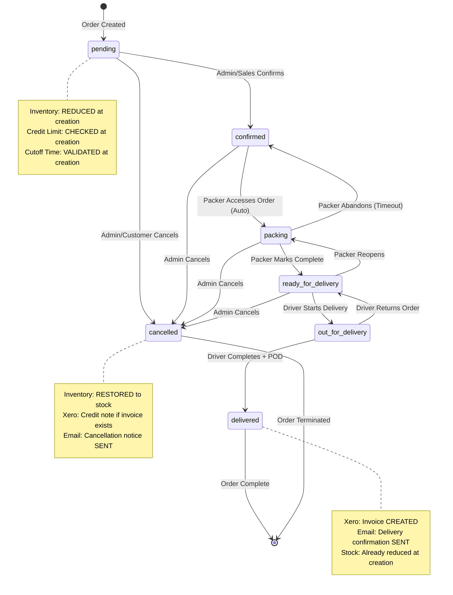
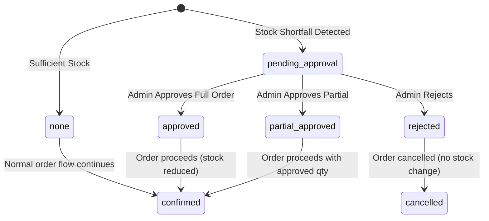

# Product Requirements Document (PRD)

## Jimmy Beef ERP System

**Version:** 1.0  
**Date:** November 13, 2025  
**Project:** Dual-Portal ERP for Australian B2B Meat Distribution

-----

## Table of Contents

1. [System Overview](#1-system-overview)
1. [Technical Architecture](#2-technical-architecture)
1. [User Roles & Permissions](#3-user-roles--permissions)
1. [Data Models](#4-data-models)
1. [Functional Requirements](#5-functional-requirements)
1. [API Specifications](#6-api-specifications)
1. [Integration Requirements](#7-integration-requirements)
1. [Non-Functional Requirements](#8-non-functional-requirements)
1. [Security Requirements](#9-security-requirements)
1. [Deployment & Infrastructure](#10-deployment--infrastructure)

-----

## 1. System Overview

### 1.1 Purpose

A dual-portal ERP system for Jimmy Beef, an Australian B2B meat distributor, enabling customers to place orders online and internal staff to manage operations, packing, and delivery logistics.

### 1.2 System Components

**Portal 1: Customer Portal** (`customer.jimmybeef.com.au`)

- Customer registration and authentication
- Product catalog with customer-specific pricing
- Order placement and tracking
- Profile management

**Portal 2: Admin Portal** (`admin.jimmybeef.com.au`)

- Company settings management
- Customer and pricing administration
- Inventory management
- Order processing and packing interface
- Delivery management with route planning
- Xero accounting integration

### 1.3 Users

- **External:** Business customers (B2B buyers)
- **Internal:** Admin, Sales, Packer, Driver, Manager

-----

## 2. Technical Architecture

### 2.1 Technology Stack

|Layer             |Technology           |Version  |Purpose                                    |
|------------------|---------------------|---------|-------------------------------------------|
|**Frontend**      |Next.js              |14+      |React framework with SSR/SSG               |
|**API Layer**     |tRPC                 |10+      |Type-safe API without REST/GraphQL         |
|**Database**      |MongoDB              |6+       |NoSQL document database                    |
|**Authentication**|Clerk                |Latest   |User authentication & management           |
|**Email**         |Resend               |Latest   |Transactional email service                |
|**File Storage**  |AWS S3 or Vercel Blob|Latest   |Image/file uploads (POD photos, signatures)|
|**Mapping**       |Mapbox + Google Maps |Latest   |Route optimization (Mapbox) + Navigation (Google Maps)|
|**Accounting**    |Xero API             |OAuth 2.0|Invoice/credit note integration            |
|**Hosting**       |Vercel or AWS        |-        |Application hosting                        |

### 2.2 Application Architecture

```
┌─────────────────────────────────────────────────────────┐
│                    Customer Portal                       │
│                  (Next.js + tRPC Client)                 │
└─────────────────┬───────────────────────────────────────┘
                  │
                  │ HTTP/tRPC
                  │
┌─────────────────▼───────────────────────────────────────┐
│                    Admin Portal                          │
│                  (Next.js + tRPC Client)                 │
└─────────────────┬───────────────────────────────────────┘
                  │
                  │ HTTP/tRPC
                  │
┌─────────────────▼───────────────────────────────────────┐
│                  tRPC API Layer                          │
│              (Server-side procedures)                    │
├──────────────────────────────────────────────────────────┤
│  • Authentication Middleware (Clerk)                     │
│  • Authorization Middleware (Role-based)                 │
│  • Input Validation (Zod)                               │
│  • Business Logic                                        │
└─────┬────────────────────┬─────────────────┬────────────┘
      │                    │                 │
      │                    │                 │
┌─────▼──────┐  ┌─────────▼──────┐  ┌──────▼──────────┐
│  MongoDB   │  │  Xero API      │  │  Resend Email   │
│  Database  │  │  (OAuth 2.0)   │  │  Service        │
└────────────┘  └────────────────┘  └─────────────────┘
```

### 2.3 Project Structure

```
jimmy-beef-erp/
├── apps/
│   ├── customer-portal/          # Customer-facing application
│   │   ├── src/
│   │   │   ├── app/              # Next.js 14 app directory
│   │   │   ├── components/       # React components
│   │   │   ├── hooks/            # Custom React hooks
│   │   │   ├── utils/            # Utility functions
│   │   │   └── trpc/             # tRPC client setup
│   │   └── package.json
│   │
│   └── admin-portal/             # Admin/operations application
│       ├── src/
│       │   ├── app/
│       │   ├── components/
│       │   ├── hooks/
│       │   ├── utils/
│       │   └── trpc/
│       └── package.json
│
├── packages/
│   ├── api/                      # tRPC API procedures
│   │   ├── src/
│   │   │   ├── routers/          # API route handlers
│   │   │   │   ├── auth.ts
│   │   │   │   ├── customer.ts
│   │   │   │   ├── product.ts
│   │   │   │   ├── order.ts
│   │   │   │   ├── inventory.ts
│   │   │   │   ├── delivery.ts
│   │   │   │   └── xero.ts
│   │   │   ├── middleware/       # Auth, logging, etc.
│   │   │   ├── context.ts        # tRPC context
│   │   │   └── root.ts           # Root router
│   │   └── package.json
│   │
│   ├── database/                 # MongoDB schemas & models
│   │   ├── src/
│   │   │   ├── models/
│   │   │   │   ├── user.ts
│   │   │   │   ├── customer.ts
│   │   │   │   ├── product.ts
│   │   │   │   ├── order.ts
│   │   │   │   ├── inventory.ts
│   │   │   │   ├── delivery.ts
│   │   │   │   └── audit.ts
│   │   │   ├── connection.ts
│   │   │   └── index.ts
│   │   └── package.json
│   │
│   ├── email/                    # Email templates & service
│   │   ├── src/
│   │   │   ├── templates/        # React email templates
│   │   │   └── service.ts        # Resend integration
│   │   └── package.json
│   │
│   └── shared/                   # Shared types, utils, constants
│       ├── src/
│       │   ├── types/
│       │   ├── constants/
│       │   └── utils/
│       └── package.json
│
├── .env.example
├── package.json
├── turbo.json                    # Turborepo configuration
└── README.md
```

-----

## 3. User Roles & Permissions

### 3.1 Role Definitions

#### Customer (External User)

**Access:** Customer Portal only

**Permissions:**

- View own profile
- Update own contact details
- View products with assigned pricing
- Place orders (if approved and within credit limit)
- View own order history
- Track delivery status

**Clerk Metadata:**

```typescript
{
  role: 'customer',
  customerId: string,
  approvalStatus: 'pending' | 'approved' | 'rejected',
  creditLimit: number,
  areaTag: 'north' | 'south' | 'east' | 'west'
}
```

-----

#### Admin (Internal User)

**Access:** Admin Portal - Full Access

**Permissions:**

- All permissions across all modules
- Manage company settings
- Approve/reject credit applications
- Manage all customers, products, orders
- Access all reports
- Configure system settings

**Clerk Metadata:**

```typescript
{
  role: 'admin',
  department: 'management'
}
```

-----

#### Sales (Internal User)

**Access:** Admin Portal - Limited

**Permissions:**

- View all customers
- Update customer information
- Manage customer-specific pricing
- Place orders on behalf of customers
- View all orders
- Cannot access: Inventory, Company Settings, User Management

**Clerk Metadata:**

```typescript
{
  role: 'sales',
  department: 'sales'
}
```

-----

#### Packer (Internal User)

**Access:** Admin Portal - Packing Module Only

**Permissions:**

- View packing interface
- See consolidated order list for packing session
- Mark items as packed
- Mark orders as ready for delivery
- Cannot access: Other modules

**Clerk Metadata:**

```typescript
{
  role: 'packer',
  department: 'operations'
}
```

-----

#### Driver (Internal User)

**Access:** Admin Portal - Delivery Module Only

**Permissions:**

- View assigned deliveries
- See delivery route and customer addresses
- Upload proof of delivery (photo/signature)
- Mark deliveries as completed
- Cannot access: Other modules

**Clerk Metadata:**

```typescript
{
  role: 'driver',
  department: 'logistics',
  vehicleNumber?: string
}
```

-----

#### Manager (Internal User)

**Access:** Admin Portal - Read-Only + Reports

**Permissions:**

- View all data (read-only)
- Access reports and analytics
- Export data
- Cannot modify: Any data

**Clerk Metadata:**

```typescript
{
  role: 'manager',
  department: 'management'
}
```

-----

### 3.2 Permission Matrix

|Module                   |Customer|Admin|Sales|Packer      |Driver       |Manager|
|-------------------------|--------|-----|-----|------------|-------------|-------|
|**Customer Management**  |        |     |     |            |             |       |
|View own profile         |✅       |✅    |✅    |❌           |❌            |✅      |
|View all customers       |❌       |✅    |✅    |❌           |❌            |✅      |
|Create customer          |❌       |✅    |✅    |❌           |❌            |❌      |
|Update customer          |Own only|✅    |✅    |❌           |❌            |❌      |
|Approve credit           |❌       |✅    |❌    |❌           |❌            |❌      |
|**Product Management**   |        |     |     |            |             |       |
|View products            |✅       |✅    |✅    |❌           |❌            |✅      |
|Create/Update products   |❌       |✅    |❌    |❌           |❌            |❌      |
|Manage pricing           |❌       |✅    |✅    |❌           |❌            |❌      |
|**Order Management**     |        |     |     |            |             |       |
|Place order              |✅       |✅    |✅    |❌           |❌            |❌      |
|View orders              |Own only|✅    |✅    |Session only|Assigned only|✅      |
|Update order status      |❌       |✅    |✅    |❌           |❌            |❌      |
|Cancel order             |❌       |✅    |✅    |❌           |❌            |❌      |
|**Inventory Management** |        |     |     |            |             |       |
|View inventory           |❌       |✅    |❌    |❌           |❌            |✅      |
|Update stock             |❌       |✅    |❌    |❌           |❌            |❌      |
|**Packing**              |        |     |     |            |             |       |
|Access packing interface |❌       |✅    |❌    |✅           |❌            |✅      |
|Mark as packed           |❌       |✅    |❌    |✅           |❌            |❌      |
|**Delivery**             |        |     |     |            |             |       |
|Access delivery interface|❌       |✅    |❌    |❌           |✅            |✅      |
|Upload POD               |❌       |✅    |❌    |❌           |✅            |❌      |
|Mark as delivered        |❌       |✅    |❌    |❌           |✅            |❌      |
|**Company Settings**     |        |     |     |            |             |       |
|View settings            |❌       |✅    |❌    |❌           |❌            |✅      |
|Update settings          |❌       |✅    |❌    |❌           |❌            |❌      |
|**Xero Integration**     |        |     |     |            |             |       |
|Trigger sync             |❌       |✅    |❌    |❌           |❌            |❌      |
|View sync logs           |❌       |✅    |❌    |❌           |❌            |✅      |

-----

## 4. Data Models

### 4.1 MongoDB Collections

#### 4.1.1 Company Collection

```typescript
interface Company {
  _id: ObjectId;
  businessName: string;
  abn: string;
  email: string;
  phone: string;
  address: {
    street: string;
    suburb: string;
    state: string;
    postcode: string;
    country: string; // Default: "Australia"
  };
  
  // Order Configuration
  orderCutoffTime: string; // Format: "HH:mm" (e.g., "14:00" for 2 PM)
  timezone: string; // Default: "Australia/Sydney"
  
  // Delivery Areas
  deliveryAreas: {
    name: string; // "north", "south", "east", "west"
    description?: string;
    suburbs: string[]; // Array of suburb names
  }[];
  
  // Xero Integration
  xero: {
    enabled: boolean;
    tenantId?: string;
    accessToken?: string; // Encrypted
    refreshToken?: string; // Encrypted
    expiresAt?: Date;
    lastSyncAt?: Date;
  };
  
  // Settings
  settings: {
    defaultCurrency: string; // Default: "AUD"
    taxRate: number; // GST rate (e.g., 0.10 for 10%)
    lowStockThreshold: number; // Default: 10
    enableEmailNotifications: boolean;
  };
  
  createdAt: Date;
  updatedAt: Date;
}
```

**Indexes:**

- `{ _id: 1 }` (default)

-----

#### 4.1.2 Customer Collection

```typescript
interface Customer {
  _id: ObjectId;
  clerkUserId: string; // Clerk user ID for authentication
  
  // Business Information
  businessName: string;
  abn: string;
  
  // Contact Information
  contactPerson: {
    firstName: string;
    lastName: string;
    email: string;
    phone: string;
    mobile?: string;
  };
  
  // Delivery Address
  deliveryAddress: {
    street: string;
    suburb: string;
    state: string;
    postcode: string;
    country: string; // Default: "Australia"
    areaTag: 'north' | 'south' | 'east' | 'west'; // Auto-assigned from suburb
    latitude?: number; // For delivery routing
    longitude?: number;
    deliveryInstructions?: string;
  };
  
  // Billing Address (optional, defaults to delivery)
  billingAddress?: {
    street: string;
    suburb: string;
    state: string;
    postcode: string;
    country: string;
  };
  
  // Credit Application
  creditApplication: {
    status: 'pending' | 'approved' | 'rejected';
    appliedAt: Date;
    reviewedAt?: Date;
    reviewedBy?: ObjectId; // Admin user ID
    creditLimit: number; // Default: 0
    paymentTerms?: string; // e.g., "Net 30", "COD"
    notes?: string;
  };
  
  // Account Status
  status: 'active' | 'suspended' | 'closed';
  
  // Metadata
  xeroContactId?: string; // Xero contact ID after sync
  
  createdAt: Date;
  updatedAt: Date;
}
```

**Indexes:**

- `{ clerkUserId: 1 }` (unique)
- `{ 'contactPerson.email': 1 }`
- `{ 'deliveryAddress.areaTag': 1 }`
- `{ 'creditApplication.status': 1 }`
- `{ status: 1 }`

-----

#### 4.1.3 Product Collection

```typescript
interface Product {
  _id: ObjectId;
  
  // Product Information
  sku: string; // Unique product code
  name: string;
  description?: string;
  category?: string; // e.g., "Beef", "Lamb", "Pork", "Poultry"
  
  // Unit Information
  unit: 'kg' | 'piece' | 'box' | 'carton';
  packageSize?: number; // e.g., 5 for "5kg box"
  
  // Pricing
  basePrice: number; // Default price in AUD
  
  // Inventory
  currentStock: number;
  lowStockThreshold?: number; // Overrides company default
  
  // Product Status
  status: 'active' | 'discontinued' | 'out_of_stock';
  
  // Metadata
  xeroItemId?: string; // Xero item ID after sync
  
  createdAt: Date;
  updatedAt: Date;
}
```

**Indexes:**

- `{ sku: 1 }` (unique)
- `{ status: 1 }`
- `{ category: 1 }`

-----

#### 4.1.4 CustomerPricing Collection

```typescript
interface CustomerPricing {
  _id: ObjectId;
  customerId: ObjectId; // Reference to Customer
  productId: ObjectId; // Reference to Product
  
  // Custom Price
  unitPrice: number; // Customer-specific price
  
  // Effective Period (optional)
  effectiveFrom?: Date;
  effectiveTo?: Date;
  
  // Metadata
  notes?: string; // e.g., "Contract pricing until Dec 2025"
  
  createdAt: Date;
  updatedAt: Date;
  createdBy: string; // Clerk user ID of admin who set the price
}
```

**Indexes:**

- `{ customerId: 1, productId: 1 }` (compound unique)
- `{ productId: 1 }`
- `{ effectiveTo: 1 }`

-----

#### 4.1.5 Order Collection

```typescript
interface Order {
  _id: ObjectId;
  orderNumber: string; // Auto-generated (e.g., "ORD-2025-001234")
  
  // Customer Information
  customerId: ObjectId;
  customerName: string; // Denormalized for quick access
  
  // Order Details
  items: {
    productId: ObjectId;
    sku: string; // Denormalized
    productName: string; // Denormalized
    unit: string; // Denormalized
    quantity: number;
    unitPrice: number; // Price at time of order
    subtotal: number; // quantity * unitPrice
  }[];
  
  // Pricing
  subtotal: number; // Sum of all item subtotals
  taxAmount: number; // GST
  totalAmount: number; // subtotal + taxAmount
  
  // Delivery Information
  deliveryAddress: {
    street: string;
    suburb: string;
    state: string;
    postcode: string;
    areaTag: 'north' | 'south' | 'east' | 'west';
    deliveryInstructions?: string;
  };
  requestedDeliveryDate: Date;
  
  // Order Status
  status: 
    | 'pending'           // Just placed, awaiting processing
    | 'confirmed'         // Confirmed by admin
    | 'packing'           // Being packed
    | 'ready_for_delivery' // Packed and ready
    | 'out_for_delivery'  // Assigned to driver
    | 'delivered'         // Completed
    | 'cancelled';        // Cancelled by admin or customer
  
  // Status History
  statusHistory: {
    status: string;
    changedAt: Date;
    changedBy: string; // Clerk user ID
    notes?: string;
  }[];
  
  // Packing Information
  packing?: {
    packedAt?: Date;
    packedBy?: string;                // Clerk user ID (packer)
    notes?: string;
    packingSequence?: number;         // Position in packing queue (1 = pack first)
                                      // Calculated by route optimization (see Section 5.3.10.3)
    packedItems?: string[];           // Array of SKUs that have been packed
  };

  // Delivery Information
  delivery?: {
    driverId?: string;                // Clerk user ID
    driverName?: string;
    assignedAt?: Date;
    deliveredAt?: Date;
    proofOfDelivery?: {
      type: 'signature' | 'photo';
      fileUrl: string;                // S3/Blob storage URL
      uploadedAt: Date;
    };
    notes?: string;
    deliverySequence?: number;        // Position in delivery route (1 = first stop)
                                      // Calculated by route optimization (see Section 5.3.10.3)
    routeId?: string;                 // Reference to RouteOptimization document ID
    estimatedArrival?: Date;          // Calculated ETA from Mapbox optimization
    actualArrival?: Date;             // Actual arrival time (for analytics)
  };
  
  // Admin Notes
  internalNotes?: string;
  
  // Xero Integration
  xero?: {
    invoiceId?: string;
    invoiceNumber?: string;
    invoiceStatus?: string;
    syncedAt?: Date;
    syncError?: string;
  };

  // Backorder Management
  // When an order exceeds available stock, it becomes a backorder requiring admin approval
  backorderStatus:
    | 'none'              // Normal order (sufficient stock at time of order)
    | 'pending_approval'  // Awaiting admin review (stock shortfall detected)
    | 'approved'          // Admin approved backorder (will fulfill when stock arrives)
    | 'rejected'          // Admin rejected backorder (order cancelled)
    | 'partial_approved'; // Partial quantity approved (some items reduced)

  stockShortfall?: {
    // Records the stock situation when backorder was created
    [productId: string]: {
      requested: number;   // Quantity customer requested
      available: number;   // Stock available at time of order
      shortfall: number;   // requested - available
    };
  };

  approvedQuantities?: {
    // For partial approvals, stores the admin-approved quantities
    [productId: string]: number;
  };

  backorderNotes?: string;        // Admin notes explaining approval/rejection decision
  expectedFulfillment?: Date;     // Expected date when stock will arrive (for approved backorders)
  reviewedBy?: string;            // Clerk user ID of admin who approved/rejected
  reviewedAt?: Date;              // Timestamp when backorder was reviewed

  // Timestamps
  orderedAt: Date;
  createdBy: string; // Clerk user ID (customer or admin placing on behalf)
  createdAt: Date;
  updatedAt: Date;
}
```

**Indexes:**

- `{ orderNumber: 1 }` (unique)
- `{ customerId: 1, orderedAt: -1 }`
- `{ status: 1, requestedDeliveryDate: 1 }`
- `{ 'deliveryAddress.areaTag': 1, requestedDeliveryDate: 1 }`
- `{ requestedDeliveryDate: 1, status: 1 }`
- `{ backorderStatus: 1, createdAt: -1 }` - For querying pending backorders

-----

#### 4.1.6 InventoryTransaction Collection

```typescript
interface InventoryTransaction {
  _id: ObjectId;
  productId: ObjectId;

  // Transaction Details
  type:
    | 'sale'          // Stock sold (from order) - automatic
    | 'adjustment'    // Manual stock change by admin
    | 'return';       // Customer return or order cancelled - automatic

  // Adjustment Type (only set when type='adjustment')
  adjustmentType?:
    | 'stock_received'          // Adding stock from supplier delivery
    | 'stock_count_correction'  // Fixing discrepancy from stocktake
    | 'damaged_goods'           // Writing off damaged inventory
    | 'expired_stock';          // Writing off expired inventory

  quantity: number; // Positive for additions, negative for reductions

  // Before/After Snapshot
  previousStock: number;
  newStock: number; // previousStock + quantity

  // Reference
  referenceType?: 'order' | 'manual';
  referenceId?: ObjectId; // Order ID if type is 'sale'

  // Metadata
  notes?: string;
  performedBy: string; // Clerk user ID
  performedAt: Date;

  createdAt: Date;
}
```

**Indexes:**

- `{ productId: 1, createdAt: -1 }`
- `{ referenceId: 1, referenceType: 1 }`
- `{ type: 1 }`
- `{ adjustmentType: 1 }`

-----

#### 4.1.7 AuditLog Collection

```typescript
interface AuditLog {
  _id: ObjectId;
  
  // User Information
  userId: string; // Clerk user ID
  userEmail: string;
  userRole: string;
  
  // Action Details
  action: string; // e.g., "customer.update", "pricing.create", "order.cancel"
  entity: string; // e.g., "customer", "product", "order"
  entityId: string; // ID of the affected entity
  
  // Changes
  changes?: {
    field: string;
    oldValue: any;
    newValue: any;
  }[];
  
  // Request Metadata
  ipAddress?: string;
  userAgent?: string;
  
  // Timestamp
  timestamp: Date;
}
```

**Indexes:**

- `{ userId: 1, timestamp: -1 }`
- `{ entity: 1, entityId: 1, timestamp: -1 }`
- `{ action: 1, timestamp: -1 }`
- `{ timestamp: -1 }` (TTL: 2 years)

-----

#### 4.1.8 SuburbAreaMapping Collection

```typescript
interface SuburbAreaMapping {
  _id: ObjectId;
  suburb: string; // Normalized suburb name (uppercase)
  state: string; // NSW, VIC, QLD, etc.
  postcode: string;
  areaTag: 'north' | 'south' | 'east' | 'west';
  
  // Geocoding
  latitude?: number;
  longitude?: number;
  
  // Metadata
  isActive: boolean; // Whether this suburb is serviced
  
  createdAt: Date;
  updatedAt: Date;
}
```

**Indexes:**

- `{ suburb: 1, state: 1 }` (compound unique)
- `{ postcode: 1 }`
- `{ areaTag: 1 }`

-----

#### 4.1.9 SystemLog Collection

```typescript
interface SystemLog {
  _id: ObjectId;
  
  // Log Details
  level: 'info' | 'warning' | 'error' | 'critical';
  service: string; // e.g., "xero-sync", "email", "order-processing"
  message: string;
  
  // Context
  context?: Record<string, any>; // Additional data
  stackTrace?: string; // For errors
  
  // Timestamp
  timestamp: Date;
}
```

**Indexes:**

- `{ level: 1, timestamp: -1 }`
- `{ service: 1, timestamp: -1 }`
- `{ timestamp: -1 }` (TTL: 90 days)

-----

#### 4.1.10 RouteOptimization Collection

```typescript
interface RouteOptimization {
  _id: ObjectId;

  // Route Identity
  deliveryDate: Date;          // Date for this optimized route
  areaTag?: 'north' | 'south' | 'east' | 'west'; // Null if multi-area route
  orderCount: number;          // Number of orders in this route

  // Route Metrics
  totalDistance: number;       // In kilometers
  totalDuration: number;       // In seconds

  // Route Geometry
  routeGeometry: string;       // GeoJSON LineString from Mapbox
  waypoints: {
    orderId: ObjectId;
    orderNumber: string;
    latitude: number;
    longitude: number;
    address: string;
    suburb: string;
    sequenceNumber: number;    // Position in delivery route (1, 2, 3...)
    estimatedArrival: Date;    // Calculated ETA from Mapbox
  }[];

  // Optimization Metadata
  optimizedAt: Date;
  optimizedBy: string;         // Clerk user ID who triggered optimization
  mapboxRouteData?: JSON;      // Full Mapbox API response for reference

  // Re-optimization Tracking
  needsReoptimization: boolean;  // True if order count changed
  lastOrderCount?: number;       // Previous order count before change

  // Timestamps
  createdAt: Date;
}
```

**Indexes:**

- `{ deliveryDate: 1, areaTag: 1 }` (compound)
- `{ optimizedAt: -1 }`
- `{ needsReoptimization: 1 }`

**Description:**

The RouteOptimization collection stores the results of Mapbox route optimization for each delivery date and area. It contains:

- **Route Geometry:** GeoJSON LineString that can be visualized on a map showing the optimized delivery route
- **Waypoints:** Ordered array of delivery stops with their sequence numbers and estimated arrival times
- **Metrics:** Total distance and duration calculated by Mapbox for the entire route
- **Re-optimization Tracking:** System automatically flags routes that need re-optimization when order count changes

This data is used to:
- Calculate `packingSequence` and `deliverySequence` for orders (see Section 5.3.10.3)
- Display optimized routes to drivers in the delivery interface
- Show estimated arrival times to customers
- Provide route visualization on maps
- Track optimization history and performance metrics

-----

### 4.2 Data Relationships

```
Company (1) -----> (many) DeliveryAreas
                   (1) Xero Configuration

Customer (1) -----> (1) Clerk User
          (1) -----> (many) CustomerPricing
          (1) -----> (many) Orders
          (1) -----> (1) SuburbAreaMapping

Product (1) -----> (many) CustomerPricing
        (1) -----> (many) InventoryTransactions
        (1) -----> (many) OrderItems

Order (1) -----> (1) Customer
      (1) -----> (many) OrderItems
      (1) -----> (many) StatusHistory
      (1) -----> (1) Delivery (optional)
      (1) -----> (1) Xero Invoice (optional)
      (1) -----> (1) RouteOptimization (optional, via routeId)

RouteOptimization (1) -----> (many) Orders
                  (1) -----> (1) DeliveryDate
                  (1) -----> (1) AreaTag (optional)

InventoryTransaction (1) -----> (1) Product
                     (1) -----> (1) Order (optional)

AuditLog (many) -----> (1) User (Clerk)
```

-----

## 5. Functional Requirements

### 5.1 Authentication & Authorization

#### 5.1.1 Clerk Integration

**Requirements:**

- Integrate Clerk for authentication on both portals
- Use Clerk’s organization feature for multi-tenancy (if needed in future)
- Store user metadata in Clerk for role-based access control
- Sync Clerk user data with Customer collection

**Customer Registration Flow:**

1. User signs up via Clerk on Customer Portal
1. System creates Clerk account with role=‘customer’
1. User fills out business profile form
1. System creates Customer document in MongoDB
1. Link Clerk user ID to Customer document
1. Set creditApplication.status = ‘pending’
1. Send email notification to admin for approval

**Admin/Staff User Creation:**

1. Admin creates user in Admin Portal
1. System creates Clerk account with appropriate role
1. Send invitation email with temporary password
1. User completes profile on first login

**tRPC Middleware:**

```typescript
// Auth middleware
const isAuthenticated = t.middleware(async ({ ctx, next }) => {
  const user = await ctx.clerk.users.getUser(ctx.userId);
  if (!user) throw new TRPCError({ code: 'UNAUTHORIZED' });
  return next({ ctx: { ...ctx, user } });
});

// Role-based middleware
const isAdmin = isAuthenticated.unstable_pipe(async ({ ctx, next }) => {
  if (ctx.user.publicMetadata.role !== 'admin') {
    throw new TRPCError({ code: 'FORBIDDEN' });
  }
  return next();
});
```

-----

### 5.2 Customer Portal

#### 5.2.1 Customer Registration & Profile

**Registration Form Fields:**

```typescript
interface RegistrationForm {
  // Business Details
  businessName: string; // Required
  abn: string; // Required, validate ABN format
  
  // Contact Person
  contactPerson: {
    firstName: string; // Required
    lastName: string; // Required
    email: string; // Required, from Clerk
    phone: string; // Required
    mobile?: string;
  };
  
  // Delivery Address
  deliveryAddress: {
    street: string; // Required
    suburb: string; // Required, autocomplete from SuburbAreaMapping
    state: string; // Auto-filled from suburb selection
    postcode: string; // Auto-filled from suburb selection
    deliveryInstructions?: string;
  };
  
  // Billing Address
  billingSameAsDelivery: boolean; // Default: true
  billingAddress?: { /* same structure */ };
  
  // Credit Application
  requestedCreditLimit: number; // Optional
  paymentTermsPreference?: string; // Optional
  
  // Terms & Conditions
  agreedToTerms: boolean; // Required
}
```

**Validation Rules:**

- ABN: Must be 11 digits, validate using ABN lookup API (optional)
- Email: Valid email format, unique in system
- Suburb: Must exist in SuburbAreaMapping
- Phone: Australian phone number format

**Business Logic:**

- Auto-assign areaTag based on suburb selection
- If suburb not in SuburbAreaMapping, show warning and require admin approval
- Geocode address using Google Maps API for delivery routing
- Create customer with status=‘active’ but creditApplication.status=‘pending’
- Send confirmation email to customer
- Send notification email to admin for credit approval

**API Endpoints:**

```typescript
// tRPC procedures
customer.register
customer.getProfile
customer.updateProfile
customer.checkSuburb // Check if suburb is serviced
```

-----

#### 5.2.2 Product Catalog & Pricing

**Product List View:**

- Display all active products
- Show customer-specific pricing (if approved customer)
- Show base price if no customer-specific pricing exists
- Display stock availability indicator
  - “In Stock” (green) if currentStock > lowStockThreshold
  - “Low Stock” (yellow) if currentStock <= lowStockThreshold
  - “Out of Stock” (red) if currentStock = 0
- Filter by category
- Search by product name or SKU
- Sort by: Name, Price, Category

**Product Detail:**

```typescript
interface ProductDisplay {
  sku: string;
  name: string;
  description: string;
  category: string;
  unit: string;
  packageSize?: number;
  unitPrice: number; // Customer-specific or base price
  stockStatus: 'in_stock' | 'low_stock' | 'out_of_stock';
}
```

**Business Logic:**

- Check if customer has approved credit application
- If approved, show CustomerPricing.unitPrice for this customer
- If no customer-specific pricing, show Product.basePrice
- Hide discontinued products
- Disable “Add to Cart” for out_of_stock products

**API Endpoints:**

```typescript
product.getAll // Get all products with customer-specific pricing
product.getById
product.searchByName
```

-----

#### 5.2.3 Order Placement

**Order Cutoff Logic:**

```typescript
function checkOrderCutoff(orderTime: Date, cutoffTime: string): {
  canPlaceForTomorrow: boolean;
  deliveryDate: Date;
  message: string;
} {
  const today = new Date(orderTime);
  const cutoff = parseTime(cutoffTime); // e.g., "14:00"
  const cutoffToday = new Date(today);
  cutoffToday.setHours(cutoff.hours, cutoff.minutes, 0, 0);
  
  if (orderTime <= cutoffToday) {
    // Before cutoff - next day delivery
    const tomorrow = new Date(today);
    tomorrow.setDate(tomorrow.getDate() + 1);
    return {
      canPlaceForTomorrow: true,
      deliveryDate: tomorrow,
      message: `Order by ${cutoffTime} for next-day delivery`
    };
  } else {
    // After cutoff - show warning
    return {
      canPlaceForTomorrow: false,
      deliveryDate: null,
      message: `Order cutoff time (${cutoffTime}) has passed. Please contact admin for delivery arrangement.`
    };
  }
}
```

**Order Form:**

```typescript
interface OrderForm {
  items: {
    productId: string;
    quantity: number; // Must be > 0
  }[];
  deliveryAddress?: Address; // Optional, defaults to customer's saved address
  deliveryInstructions?: string;
  requestedDeliveryDate?: Date; // Optional, defaults to next available date
}
```

**Validation Rules:**

- Customer must have approved credit application
- Check if order total exceeds credit limit (if applicable)
- Validate stock availability for each item
- Minimum order quantity per product (if configured)
- Check order cutoff time

**Order Calculation:**

```typescript
interface OrderCalculation {
  items: {
    productId: string;
    quantity: number;
    unitPrice: number;
    subtotal: number;
  }[];
  subtotal: number;
  taxRate: number; // From Company settings
  taxAmount: number;
  totalAmount: number;
}
```

**Business Logic:**

1. Validate customer approval status
1. Check order cutoff time
1. Calculate order totals with GST
1. Check credit limit (current outstanding + new order <= limit)
1. Reserve stock (reduce inventory)
1. Create Order document with status=‘pending’
1. Create InventoryTransaction for each item (type=‘sale’)
1. Send order confirmation email to customer
1. Send new order notification to admin/sales
1. If after cutoff, flag order for admin review

**API Endpoints:**

```typescript
order.create
order.calculateTotal // Calculate before submission
order.checkCutoff // Check if can place for next day
```

-----

#### 5.2.4 Order History & Tracking

**Order List View:**

- Show all customer’s orders, newest first
- Display: Order number, Date, Total, Status, Delivery date
- Filter by: Status, Date range
- Click to view order details

**Order Detail View:**

```typescript
interface OrderDetailView {
  orderNumber: string;
  orderedAt: Date;
  status: string;
  statusHistory: StatusHistory[];
  items: OrderItem[];
  pricing: {
    subtotal: number;
    taxAmount: number;
    totalAmount: number;
  };
  deliveryAddress: Address;
  requestedDeliveryDate: Date;
  tracking: {
    packed: boolean;
    packedAt?: Date;
    outForDelivery: boolean;
    deliveredAt?: Date;
  };
}
```

**Order Status Display:**

- Pending: “Your order is being processed”
- Confirmed: “Order confirmed, preparing for packing”
- Packing: “Your order is being packed”
- Ready for Delivery: “Order packed and ready for dispatch”
- Out for Delivery: “Your order is on the way”
- Delivered: “Order delivered on [date]” + Show POD
- Cancelled: “Order cancelled” + reason

**API Endpoints:**

```typescript
order.getMyOrders // Get all orders for logged-in customer
order.getById // Get order details
```

-----

### 5.3 Admin Portal

#### 5.3.1 Dashboard

**Key Metrics:**

- Pending credit applications count
- Today’s orders (count + total value)
- Orders ready for packing (count)
- Orders out for delivery (count)
- Low stock alerts (count)
- Recent Xero sync status

**Quick Actions:**

- View pending credit applications
- View today’s packing list
- View today’s delivery schedule
- Check inventory levels
- Sync with Xero

-----

#### 5.3.2 Company Settings

**Configuration Form:**

```typescript
interface CompanySettings {
  // Business Details
  businessName: string;
  abn: string;
  email: string;
  phone: string;
  address: Address;
  
  // Order Settings
  orderCutoffTime: string; // HH:mm format
  timezone: string; // IANA timezone
  
  // Financial Settings
  defaultCurrency: string;
  taxRate: number; // GST rate
  
  // Inventory Settings
  lowStockThreshold: number;
  
  // Notifications
  enableEmailNotifications: boolean;
  adminNotificationEmails: string[]; // Emails to receive admin alerts
  
  // Delivery Areas
  deliveryAreas: {
    name: string;
    suburbs: string[]; // Multi-select from SuburbAreaMapping
  }[];
}
```

**API Endpoints:**

```typescript
company.getSettings
company.updateSettings // Admin only
```

-----

#### 5.3.3 Customer Management

**Customer List:**

- Show all customers with: Name, Email, Status, Credit status, Area
- Filter by: Approval status, Area tag, Active/Suspended
- Search by: Name, Email, ABN
- Sort by: Name, Created date

**Customer Detail/Edit:**

```typescript
interface CustomerManagement {
  // All fields from Customer model
  // Plus:
  creditApplication: {
    status: 'pending' | 'approved' | 'rejected';
    creditLimit: number;
    paymentTerms: string;
    notes: string; // Admin notes
    reviewedBy?: string;
    reviewedAt?: Date;
  };
  
  // Account management
  status: 'active' | 'suspended' | 'closed';
  suspensionReason?: string;
  
  // Activity summary
  totalOrders: number;
  totalSpent: number;
  averageOrderValue: number;
  lastOrderDate?: Date;
}
```

**Credit Approval Workflow:**

1. Admin reviews pending application
1. Set credit limit and payment terms
1. Add internal notes
1. Approve or reject
1. System sends email notification to customer
1. If approved, sync to Xero as new contact

**API Endpoints:**

```typescript
customer.getAll // With filters
customer.getById
customer.update // Admin/Sales only
customer.approveCredit // Admin only
customer.rejectCredit // Admin only
customer.suspend // Admin only
customer.activate // Admin only
```

-----

#### 5.3.4 Product Management

**Product List:**

- Show all products with: SKU, Name, Category, Base price, Stock, Status
- Filter by: Category, Status, Stock level
- Search by: Name, SKU
- Sort by: Name, Stock, Price

**Product Form:**

```typescript
interface ProductForm {
  sku: string; // Required, unique
  name: string; // Required
  description?: string;
  category?: string; // Dropdown or free text
  unit: 'kg' | 'piece' | 'box' | 'carton'; // Required
  packageSize?: number;
  basePrice: number; // Required, > 0
  currentStock: number; // Required, >= 0
  lowStockThreshold?: number;
  status: 'active' | 'discontinued';
}
```

**Stock Management:**

- Show current stock level
- Show recent transactions (last 20)
- Manual stock adjustment form:

  ```typescript
  interface StockAdjustment {
    adjustmentType:
      | 'stock_received'          // Adding stock from supplier delivery
      | 'stock_count_correction'  // Fixing discrepancy from stocktake
      | 'damaged_goods'           // Writing off damaged inventory
      | 'expired_stock';          // Writing off expired inventory
    quantity: number; // Positive to add, negative to reduce
    notes: string; // Required for all adjustments
  }
  ```
- Low stock alert indicator

**API Endpoints:**

```typescript
product.getAll
product.getById
product.create // Admin only
product.update // Admin only
product.adjustStock // Admin only
product.getStockHistory
```

-----

#### 5.3.5 Customer-Specific Pricing

**Pricing Management Interface:**

**View 1: By Customer**

- Select customer from dropdown
- Show list of products with their pricing:
  - Product name, SKU
  - Base price
  - Customer-specific price (if set)
  - Effective dates
- Add/Edit/Remove custom pricing

**View 2: By Product**

- Select product from dropdown
- Show list of customers with custom pricing for this product
- Add new customer pricing

**Pricing Form:**

```typescript
interface CustomerPricingForm {
  customerId: string; // Required
  productId: string; // Required
  unitPrice: number; // Required, must be > 0
  effectiveFrom?: Date; // Optional
  effectiveTo?: Date; // Optional
  notes?: string;
}
```

**Audit Trail:**

- Track all pricing changes
- Display: Changed by, Changed at, Old price, New price

**Business Logic:**

- Prevent duplicate pricing (same customer + product + overlapping dates)
- Validate unitPrice > 0
- If effectiveTo is set, automatically deactivate when date passes
- Log all changes to AuditLog collection

**API Endpoints:**

```typescript
customerPricing.getByCustomer
customerPricing.getByProduct
customerPricing.create // Admin/Sales only
customerPricing.update // Admin/Sales only
customerPricing.delete // Admin/Sales only
customerPricing.getAuditTrail
```

-----

#### 5.3.6 Order Management

**Order List Views:**

**All Orders View:**

- Show all orders with filters
- Columns: Order #, Customer, Date, Status, Total, Delivery date, Area
- Filters: Status, Date range, Customer, Area tag
- Bulk actions: Export to CSV

**Today’s Orders View:**

- Orders with requestedDeliveryDate = today
- Group by status
- Quick status update buttons

**Create Order on Behalf of Customer:**

```typescript
interface AdminOrderForm {
  customerId: string; // Required, dropdown
  items: {
    productId: string;
    quantity: number;
  }[];
  deliveryAddress?: Address; // Optional, defaults to customer address
  requestedDeliveryDate: Date; // Required
  internalNotes?: string; // Admin notes
  bypassCutoff: boolean; // Admin can bypass cutoff time
  bypassCreditLimit: boolean; // Admin can bypass credit limit with note
}
```

**Order Detail/Edit:**

- View all order details
- Update order status
- Add internal notes
- Cancel order (with reason)
- Modify delivery address
- Resend order confirmation email

**Order Status Management:**

```typescript
interface StatusUpdate {
  newStatus: Order['status'];
  notes?: string;
}
```

**API Endpoints:**

```typescript
order.getAll // With filters, Admin/Sales/Manager
order.getById
order.create // Customer or Admin/Sales on behalf
order.updateStatus // Admin/Sales only
order.cancel // Admin/Sales only
order.addNote // Admin/Sales only
```

-----

#### 5.3.7 Packing Interface

**Purpose:** Provide packers with a consolidated view of all orders for efficient packing.

**Packing Session View:**

**Date Selector:**

- Select delivery date (default: tomorrow)
- Show only orders with requestedDeliveryDate = selected date
- Show only orders with status = ‘confirmed’ or ‘packing’

**Consolidated Product List:**

```typescript
interface PackingSessionSummary {
  deliveryDate: Date;
  orders: {
    orderId: string;
    orderNumber: string;
    customerName: string;
    areaTag: string;
  }[];
  
  // Aggregated product needs
  productSummary: {
    productId: string;
    sku: string;
    productName: string;
    unit: string;
    totalQuantity: number; // Sum across all orders
    orders: {
      orderNumber: string;
      quantity: number;
    }[];
  }[];
}
```

**Packing Workflow:**

1. **Product Summary View** (default):
- Show total quantity needed per product
- Checklist to mark products as gathered
- Visual progress indicator
1. **Order-by-Order View**:
- List of orders for the session
- Click to expand order details
- Checklist per order item
- Mark entire order as packed

**Packing Sequence:**

Orders are displayed to packers in optimal sequence calculated by the route optimization system (see Section 5.3.10.3 for detailed algorithm). The sequence ensures:
- **LIFO van loading:** Last delivery is packed first, so it goes into the van first
- **Area grouping:** Orders are grouped by delivery area (North, East, South, West)
- **Route optimization:** Sequence follows reverse delivery order for efficient unloading

**How Packing Sequence is Determined:**

1. **Automatic Optimization:** When packer opens packing interface for a delivery date:
   - System checks if route optimization exists for that date
   - If missing or order count changed: Automatically trigger Mapbox route optimization
   - Orders receive `packingSequence` numbers (1, 2, 3...) in LIFO order
   - Frontend displays "Optimizing routes..." during calculation (~2-5 seconds)

2. **Manual Optimization:** Admin/packer can click "Optimize Route" button to force re-optimization

3. **Display Order:** Orders in "Order-by-Order View" are sorted by `packingSequence` (ascending)
   - Order with packingSequence=1 appears first (pack this first)
   - Order with packingSequence=8 appears last (pack this last)

**Example:**
```
Delivery Route (optimized):
  North Stop 1 → North Stop 2 → North Stop 3 → East Stop 4

Packing Order (reverse for LIFO):
  1. East Stop 4 (last delivery, goes in van first)
  2. North Stop 3
  3. North Stop 2
  4. North Stop 1 (first delivery, goes in van last)
```

**Rationale:** When driver arrives at North Stop 1 (first delivery), the order is at the back/top of the van load, easily accessible without unloading other orders.

**Order Card:**

```typescript
interface PackingOrderCard {
  orderId: string;
  orderNumber: string;
  customerName: string;
  deliveryAddress: string;
  areaTag: string;
  items: {
    sku: string;
    productName: string;
    quantity: number;
    packed: boolean; // Checkbox
  }[];
  status: 'confirmed' | 'packing' | 'ready_for_delivery';
  allItemsPacked: boolean;
}
```

**Actions:**

- Mark item as packed (checkbox)
- Add packing notes
- Mark entire order as “Ready for Delivery”
  - Updates status to ‘ready_for_delivery’
  - Records packer ID and timestamp
  - Sends notification to delivery team

**Business Logic:**

- Only show orders for selected delivery date
- Auto-update order status to ‘packing’ when packer accesses order
- Validate all items checked before marking as ready
- Create audit log entry for status changes

**API Endpoints:**

```typescript
packing.getSession // Get packing session for date (basic - alphabetical order)
packing.getOptimizedSession // Get packing session with optimized sequencing
packing.markItemPacked
packing.markOrderReady // Mark order as ready for delivery
packing.addPackingNotes

// Route Optimization
packing.optimizeRoute({ deliveryDate, force?, areaTag? }) // Trigger Mapbox optimization
packing.getRouteStatus({ deliveryDate }) // Check if route needs re-optimization
packing.getRouteDetails({ deliveryDate, areaTag? }) // Get route geometry for map
```

-----

#### 5.3.8 Delivery Management

**Purpose:** Provide drivers with delivery schedule and route optimization.

**Delivery Schedule View:**

**Date Selector:**

- Select delivery date (default: today)
- Show orders with status = ‘ready_for_delivery’ or ‘out_for_delivery’

**Delivery List:**

```typescript
interface DeliverySchedule {
  deliveryDate: Date;
  orders: {
    orderId: string;
    orderNumber: string;
    customerName: string;
    deliveryAddress: {
      street: string;
      suburb: string;
      postcode: string;
      areaTag: string;
      latitude: number;
      longitude: number;
      deliveryInstructions?: string;
    };
    items: OrderItem[];
    totalAmount: number;
    status: 'ready_for_delivery' | 'out_for_delivery' | 'delivered';
    driverId?: string;
  }[];
}
```

**Route Optimization:**

The system uses **Mapbox Directions API** to automatically calculate optimal delivery routes. The optimization process:

- Solves the traveling salesman problem (TSP) for each delivery area
- Calculates total distance, duration, and individual ETAs for each stop
- Generates route geometry (GeoJSON LineString) for map visualization
- Assigns delivery sequence numbers (1 = first stop, 2 = second stop, etc.)
- Stores optimization results in RouteOptimization collection (see Section 4.1.10)

**Route Optimization Workflow:**

1. **Automatic Trigger:** Route optimization runs when:
   - Packer opens packing interface (if not already optimized)
   - Last order for a delivery date is marked 'ready_for_delivery'
   - Order count changes for an already-optimized date

2. **Manual Trigger:** Admin/packer can force re-optimization via "Optimize Route" button

3. **Optimization Process:**
   - Group orders by area (North, East, South, West)
   - For each area: Call Mapbox with all delivery coordinates
   - Mapbox returns optimized route with waypoint sequence
   - System assigns `deliverySequence` numbers following the optimized route
   - System calculates `packingSequence` in reverse (LIFO van loading)

**Delivery Sequence:**

Drivers see orders sorted by `deliverySequence` (ascending). This ensures:
- Efficient route following (minimal backtracking)
- Accurate ETAs for customers
- Fuel efficiency
- Time optimization

**Example Route Optimization Result:**

```typescript
interface RouteOptimizationResult {
  deliveryDate: Date;
  areaTag: 'north' | 'south' | 'east' | 'west';
  totalDistance: number;     // In kilometers (e.g., 45.3)
  totalDuration: number;     // In seconds (e.g., 5400 = 90 minutes)
  routeGeometry: string;     // GeoJSON LineString for map display
  waypoints: {
    orderId: string;
    orderNumber: string;
    customerName: string;
    address: string;
    latitude: number;
    longitude: number;
    sequenceNumber: number;  // Delivery order (1, 2, 3...)
    estimatedArrival: Date;  // Calculated ETA
  }[];
}
```

**Mapbox + Google Maps Integration:**

- **Mapbox Directions API:** Used for route optimization calculations (TSP solver)
- **Google Maps:** Used for driver navigation links

For each delivery address, driver sees:
- **"Open in Google Maps" button** with navigation link
- Google Maps URL: `https://www.google.com/maps/dir/?api=1&destination=${latitude},${longitude}`
- Optional: Multi-stop route URL with waypoints for full route navigation

**Configuration:**

```
MAPBOX_ACCESS_TOKEN=pk.ey...
WAREHOUSE_LATITUDE=-33.8688
WAREHOUSE_LONGITUDE=151.2093
```

For detailed route optimization algorithm, see Section 5.3.10.3.

**Delivery Card:**

```typescript
interface DeliveryCard {
  orderId: string;
  orderNumber: string;
  customerName: string;
  contactPhone: string;
  deliveryAddress: string;
  deliveryInstructions?: string;
  items: {
    productName: string;
    quantity: number;
    unit: string;
  }[];
  
  // Actions
  actions: {
    openInMaps: string; // URL
    call: string; // tel: URL
    markOutForDelivery: boolean;
    markDelivered: boolean;
    uploadProofOfDelivery: boolean;
  };
  
  // Status
  status: string;
  deliveredAt?: Date;
  proofOfDelivery?: ProofOfDelivery;
}
```

**Proof of Delivery (POD):**

**Option 1: Photo Upload**

- Take photo with camera or upload from device
- Compress image (max 2MB)
- Upload to S3/Blob storage
- Store URL in Order.delivery.proofOfDelivery

**Option 2: Signature Capture**

- Use signature pad library (signature_pad)
- Capture customer signature on touch screen
- Convert to image (PNG)
- Upload to storage
- Store URL in Order.delivery.proofOfDelivery

**POD Form:**

```typescript
interface ProofOfDeliveryForm {
  orderId: string;
  type: 'signature' | 'photo';
  file: File; // Image file
  notes?: string; // Delivery notes
  deliveredAt: Date; // Timestamp
}
```

**Delivery Workflow:**

1. Driver marks order as “Out for Delivery”
- Status: ‘ready_for_delivery’ → ‘out_for_delivery’
- Record driverId and timestamp
- Send notification to customer
1. Driver navigates to address using Google Maps
1. Driver completes delivery and uploads POD
1. Driver marks as “Delivered”
- Status: ‘out_for_delivery’ → ‘delivered’
- Upload POD (photo or signature)
- Record delivery timestamp
- Send notification to customer with delivery confirmation

**Business Logic:**

- Only assigned driver can update delivery status
- POD required before marking as delivered
- Validate image file (type, size)
- Compress images before upload
- Create audit log entry

**API Endpoints:**

```typescript
delivery.getSchedule // Get deliveries for date (sorted by deliverySequence)
delivery.assignDriver // Admin assigns driver to order
delivery.markOutForDelivery // Driver marks as out for delivery
delivery.uploadProofOfDelivery // Driver uploads POD (photo/signature)
delivery.markDelivered // Driver marks as delivered
delivery.returnOrder // Driver returns undelivered order to warehouse

// Route Optimization
delivery.getRouteOptimization // Get Mapbox-optimized route with geometry
delivery.getRouteDetails // Get route waypoints and ETAs
```

-----

#### 5.3.9 Inventory Management

**Inventory Dashboard:**

- Current stock levels for all products
- Low stock alerts (below threshold)
- Out of stock products
- Recent stock movements

**Stock Level View:**

```typescript
interface InventoryDashboard {
  lowStockCount: number;
  outOfStockCount: number;
  totalProducts: number;
  
  products: {
    productId: string;
    sku: string;
    name: string;
    currentStock: number;
    lowStockThreshold: number;
    status: 'ok' | 'low' | 'out';
    lastRestocked?: Date;
    averageDailySales?: number; // Optional analytics
  }[];
}
```

**Stock Management:**

**Adjust Stock (Unified Form):**

All manual stock changes use a single form with adjustment types:

```typescript
interface StockAdjustmentForm {
  productId: string;
  adjustmentType:
    | 'stock_received'          // Adding stock from supplier delivery
    | 'stock_count_correction'  // Fixing discrepancy from stocktake
    | 'damaged_goods'           // Writing off damaged inventory
    | 'expired_stock';          // Writing off expired inventory
  quantity: number; // Positive to add, negative to reduce
  notes: string; // Required for all adjustments
}
```

**Stock History:**

- Show InventoryTransaction records for selected product
- Display: Date, Type, AdjustmentType, Quantity, Before/After, Performed by, Notes
- Filter by: Date range, Transaction type, Adjustment type
- Export to CSV

**Low Stock Alerts:**

- Email notification when stock falls below threshold
- Dashboard badge showing count
- Auto-generated suggested reorder quantities (optional)

**Business Logic:**

- Prevent negative stock (block if adjustment would result in negative)
- Create InventoryTransaction record with type='adjustment' and adjustmentType for audit trail
- Update Product.currentStock atomically
- Send email alert when stock falls below threshold
- Log all changes to AuditLog
- Notes are required for all stock adjustments

**API Endpoints:**

```typescript
product.adjustStock // Admin only - unified stock adjustment
product.getStockHistory // Admin only - transaction history for a product
inventory.getDashboard
inventory.getProductStock
inventory.getLowStockAlerts
```

-----

### 5.3.10 Order Workflow & Route Optimization

This section provides comprehensive documentation of the order lifecycle, state transitions, route optimization strategy, and integration timing that powers the ERP system's order fulfillment process.

#### 5.3.10.1 Order State Machine

**State Definitions:**

```typescript
type OrderStatus =
  | 'pending'           // Order created, awaiting admin confirmation
  | 'confirmed'         // Admin/sales confirmed, ready for packing
  | 'packing'           // Packer is actively packing the order
  | 'ready_for_delivery' // Packing complete, ready for driver assignment
  | 'out_for_delivery'  // Driver has taken order for delivery
  | 'delivered'         // Order successfully delivered with POD
  | 'cancelled';        // Order cancelled (can happen at any stage before delivery)
```

**State Transition Diagram:**



**Valid State Transitions:**

| From Status | To Status | Trigger | Actor | Automatic? |
|-------------|-----------|---------|-------|------------|
| *Order Created* | `pending` | Order submission | Customer/Admin | ✅ Yes |
| `pending` | `confirmed` | Order confirmation | Admin/Sales | ❌ Manual |
| `pending` | `cancelled` | Order cancellation | Admin/Customer | ❌ Manual |
| `confirmed` | `packing` | Packer opens order | Packer | ✅ Yes (auto-transition) |
| `confirmed` | `cancelled` | Order cancellation | Admin | ❌ Manual |
| `packing` | `ready_for_delivery` | All items packed | Packer | ❌ Manual |
| `packing` | `confirmed` | Session timeout/abandon | System | ✅ Yes (after 30 min idle) |
| `packing` | `cancelled` | Order cancellation | Admin | ❌ Manual |
| `ready_for_delivery` | `out_for_delivery` | Driver starts run | Driver | ❌ Manual |
| `ready_for_delivery` | `packing` | Packer reopens | Packer | ❌ Manual |
| `ready_for_delivery` | `cancelled` | Order cancellation | Admin | ❌ Manual |
| `out_for_delivery` | `delivered` | Delivery complete + POD | Driver | ❌ Manual |
| `out_for_delivery` | `ready_for_delivery` | Failed delivery | Driver | ❌ Manual |
| `delivered` | *Order Complete* | N/A | System | ✅ Yes (terminal state) |
| `cancelled` | *Order Terminated* | N/A | System | ✅ Yes (terminal state) |

**Invalid State Transitions (BLOCKED):**

These transitions are **NOT ALLOWED** and should be rejected by the API:

| From | To | Reason |
|------|-----|--------|
| `pending` | `packing` | Must be confirmed first |
| `pending` | `ready_for_delivery` | Must go through packing |
| `pending` | `out_for_delivery` | Must go through packing |
| `pending` | `delivered` | Cannot skip workflow |
| `confirmed` | `ready_for_delivery` | Must go through packing |
| `confirmed` | `out_for_delivery` | Must go through packing |
| `confirmed` | `delivered` | Must go through packing |
| `packing` | `out_for_delivery` | Must mark ready first |
| `packing` | `delivered` | Must complete delivery workflow |
| `delivered` | *any other status* | Terminal state, cannot change |
| `cancelled` | *any other status* | Terminal state, cannot change |
| *any status* | `pending` | Cannot go backward to pending |

-----

#### 5.3.10.2 State Transition Specifications

##### Pending → Confirmed

**Business Rules:**

- **Prerequisites:**
  - Customer must have approved credit application
  - All order items must be in stock
  - Order total doesn't exceed available credit limit
  - Requested delivery date is valid and in the future

- **Validations:**
  - Check if inventory still available (stock might have changed since order creation)
  - Recalculate credit limit in case of other pending orders
  - Verify delivery date is achievable
  - Validate customer account is still active

- **Who Can Confirm:**
  - Admin role: ✅ Yes
  - Sales role: ✅ Yes
  - All other roles: ❌ No

- **Actions on Confirmation:**
  - Update order status to 'confirmed'
  - Record who confirmed and when in statusHistory
  - Send email to customer: "Order Confirmed - Being Prepared for Packing"
  - Send email to warehouse: "New Order Confirmed - Prepare for Packing"
  - Optional: Assign to packing queue with priority

- **API Specification:**

```typescript
order.confirm: protectedProcedure
  .input(z.object({
    orderId: z.string(),
    notes: z.string().optional(),
    priority: z.enum(['normal', 'urgent']).default('normal'),
  }))
  .use(isAdminOrSales)
  .mutation(async ({ input, ctx }) => {
    // 1. Validate current status (must be 'pending')
    // 2. Validate prerequisites (stock, credit, delivery date, customer status)
    // 3. Update order to 'confirmed'
    // 4. Add statusHistory entry
    // 5. Send notifications
    // 6. Log to audit trail
  })
```

##### Confirmed → Packing

**Business Rules:**

- **Trigger:** Automatic when packer accesses order in packing interface
- **Session Management:** Packing session has 30-minute timeout
- **Who Can Trigger:**
  - Packer role: ✅ Yes (by accessing order)
  - Admin role: ✅ Yes (can manually set to packing)

- **Actions on Transition:**
  - Update order status to 'packing'
  - Record packer ID and start time
  - Generate packing session ID
  - Set 30-minute timeout (auto-revert to 'confirmed' if abandoned)
  - NO email notifications (internal state change)

- **Session Timeout Handling:**
  - Background job runs every 5 minutes
  - Orders in 'packing' status with no activity for 30+ minutes are reverted to 'confirmed'
  - Warehouse manager is notified of timeout

##### Packing → Ready for Delivery

**Business Rules:**

- **Prerequisites:**
  - All order items must be marked as packed
  - Must be same packer who started the session (or admin override)

- **Validations:**
  - Verify all items have been checked in packing interface
  - Optional: Verify packed quantities match ordered quantities

- **Actions on Completion:**
  - Update order status to 'ready_for_delivery'
  - Record packing completion time and packer ID
  - Save packed items details
  - Trigger route optimization if this was the last order for the day
  - Send notification to delivery team
  - Optional: Send notification to customer that order is packed

##### Ready for Delivery → Out for Delivery

**Business Rules:**

- **Who Can Trigger:**
  - Driver role: ✅ Yes (self-assigns)
  - Admin role: ✅ Yes (can assign to specific driver)

- **Prerequisites:**
  - Order in 'ready_for_delivery' status
  - Driver authenticated
  - Delivery date is today or in the past

- **Actions on Transition:**
  - Update order status to 'out_for_delivery'
  - Record driver ID, driver name, assignment time
  - Optional: Record estimated delivery time (from route optimization)
  - Send email to customer: "Your Order Is On the Way - Driver [Name] en route"
  - Optional: Send tracking notification to admin

##### Out for Delivery → Delivered

**Business Rules:**

- **Prerequisites (STRICT):**
  - Order in 'out_for_delivery' status
  - Must be same driver who started delivery
  - Proof of delivery (POD) REQUIRED - photo or signature

- **POD Validation:**
  - Allowed file types: JPEG, PNG, WebP
  - Maximum file size: 5MB
  - Minimum image dimensions: 200x200 pixels

- **Actions on Completion:**
  - Update order status to 'delivered'
  - Upload POD to file storage (S3/Vercel Blob)
  - Record delivery timestamp, POD URL, recipient name
  - Optional: Record GPS coordinates
  - Send email to customer: "Order Delivered - Thank you!" (includes POD link)
  - **Trigger Xero invoice creation** (asynchronous queue)
  - Log to audit trail

- **Xero Integration:**
  - Invoice creation is triggered automatically but runs asynchronously
  - If Xero sync fails, order remains 'delivered' and admin is notified
  - Retry logic: 3 attempts with 1-minute delay
  - Manual fallback: Admin can manually trigger sync from order details

##### Order Cancellation (Any Status → Cancelled)

**Business Rules:**

- **Cannot Cancel:** Orders with status 'delivered' (use return/refund process instead)

- **Who Can Cancel:**

| Status | Customer | Admin | Sales | Manager | Notes |
|--------|----------|-------|-------|---------|-------|
| `pending` | ✅ Yes | ✅ Yes | ✅ Yes | ❌ No | Customer can self-cancel |
| `confirmed` | ❌ No | ✅ Yes | ✅ Yes | ❌ No | Customer cannot cancel - must contact admin |
| `packing` | ❌ No | ✅ Yes* | ✅ Yes* | ❌ No | *Requires manager approval |
| `ready_for_delivery` | ❌ No | ✅ Yes* | ✅ Yes* | ❌ No | *Requires manager approval |
| `out_for_delivery` | ❌ No | ✅ Yes* | ✅ Yes* | ❌ No | *Requires manager approval |
| `delivered` | ❌ No | ❌ No | ❌ No | ❌ No | Use return process |

- **Actions on Cancellation:**
  - Update order status to 'cancelled'
  - Record who cancelled, when, and reason
  - **Restore inventory immediately** - create InventoryTransaction records (type='return')
  - Increment Product.currentStock for each item
  - If Xero invoice exists: Queue credit note creation (asynchronous)
  - Send email to customer: "Order Cancelled - [Reason]"
  - If order was 'out_for_delivery': Send URGENT notification to driver to return
  - Log to audit trail

- **Inventory Restoration:**

```typescript
// For each order item, create InventoryTransaction
{
  productId: item.productId,
  type: 'return',
  quantity: item.quantity,  // Positive (adding back to stock)
  previousStock: product.currentStock,
  newStock: product.currentStock + item.quantity,
  referenceType: 'order',
  referenceId: order.id,
  notes: `Cancelled order ${order.orderNumber} - restoring ${item.quantity} units`,
  performedBy: userId,
}
```

-----

#### 5.3.10.2.1 Backorder Management System

This section documents the backorder workflow for handling orders that exceed available stock levels.

##### Overview

When a customer places an order that exceeds current stock availability, the system automatically creates a **backorder** requiring admin approval. This allows the business to:
- Accept orders for items that are temporarily out of stock
- Give admins control over whether to commit to fulfilling stock shortfalls
- Offer partial fulfillment when only some quantities are available
- Maintain customer relationships by not outright rejecting orders

##### Backorder Status Flow



##### Backorder Status Definitions

```typescript
type BackorderStatus =
  | 'none'              // Normal order - sufficient stock at time of order
  | 'pending_approval'  // Stock shortfall detected - awaiting admin review
  | 'approved'          // Admin approved full backorder
  | 'rejected'          // Admin rejected backorder
  | 'partial_approved'; // Admin approved partial quantities
```

##### Stock Validation at Order Creation

When an order is created, the system validates stock availability:

```typescript
interface StockValidationResult {
  requiresBackorder: boolean;
  stockShortfall: Record<string, {
    requested: number;   // Quantity customer requested
    available: number;   // Current stock level
    shortfall: number;   // requested - available
  }>;
}

function validateStockWithBackorder(
  items: Array<{ productId: string; quantity: number }>,
  products: Array<{ id: string; currentStock: number }>
): StockValidationResult {
  const stockShortfall: StockValidationResult['stockShortfall'] = {};
  let requiresBackorder = false;

  for (const item of items) {
    const product = products.find(p => p.id === item.productId);
    if (product && item.quantity > product.currentStock) {
      requiresBackorder = true;
      stockShortfall[item.productId] = {
        requested: item.quantity,
        available: product.currentStock,
        shortfall: item.quantity - product.currentStock,
      };
    }
  }

  return { requiresBackorder, stockShortfall };
}
```

##### Credit Limit Calculation with Backorders

**Critical Business Rule:** Pending backorders do NOT count against available credit.

Only orders with `backorderStatus` NOT equal to `'pending_approval'` count against the credit limit:

```typescript
async function calculateAvailableCredit(customerId: string): Promise<number> {
  const customer = await db.customer.findUnique({ where: { id: customerId } });

  // Sum only orders that are NOT pending_approval backorders
  const outstandingOrders = await db.order.aggregate({
    where: {
      customerId,
      status: { in: ['pending', 'confirmed', 'packing', 'ready_for_delivery'] },
      backorderStatus: { not: 'pending_approval' },  // Exclude pending backorders
    },
    _sum: { totalAmount: true },
  });

  const outstandingBalance = outstandingOrders._sum.totalAmount || 0;
  return customer.creditLimit - outstandingBalance;
}
```

**Rationale:** Pending backorders are not guaranteed to proceed, so they shouldn't block the customer's ability to place other orders while waiting for approval.

##### Inventory Timing for Backorders

**Stock is NOT reduced when backorder is created** (unlike normal orders).

**Stock is reduced ONLY when backorder is approved:**

| Order Type | When Stock is Reduced |
|------------|----------------------|
| Normal order | Immediately at order creation |
| Backorder (pending) | NOT reduced |
| Backorder (approved) | At time of approval |
| Backorder (partial) | Only approved quantities reduced at approval |
| Backorder (rejected) | Never reduced |

##### API Endpoints

**Get Pending Backorders (Admin/Sales only):**

```typescript
// order.getPendingBackorders
input: z.object({
  customerId: z.string().optional(),
  dateFrom: z.date().optional(),
  dateTo: z.date().optional(),
  limit: z.number().default(50),
  cursor: z.string().optional(),
});

output: {
  orders: Array<{
    id: string;
    orderNumber: string;
    customerId: string;
    customerName: string;
    totalAmount: number;
    requestedDeliveryDate: Date;
    items: Array<{
      productId: string;
      productName: string;
      sku: string;
      quantity: number;
      unit: string;
      unitPrice: number;
    }>;
    stockShortfall: Record<string, {
      requested: number;
      available: number;
      shortfall: number;
    }>;
    createdAt: Date;
  }>;
  nextCursor?: string;
};
```

**Approve Backorder (Admin/Sales only):**

```typescript
// order.approveBackorder
input: z.object({
  orderId: z.string(),
  approvedQuantities: z.record(z.string(), z.number()).optional(), // For partial approval
  expectedFulfillment: z.date().optional(),
  notes: z.string().optional(),
});

// Process:
// 1. If approvedQuantities provided → partial_approved, recalculate order totals
// 2. If no approvedQuantities → approved (full approval)
// 3. Set order.status = 'confirmed'
// 4. Create inventory transactions (reduce stock)
// 5. Set reviewedBy, reviewedAt, backorderNotes
// 6. Send approval email to customer
```

**Reject Backorder (Admin/Sales only):**

```typescript
// order.rejectBackorder
input: z.object({
  orderId: z.string(),
  reason: z.string().min(10), // Minimum 10 characters required
});

// Process:
// 1. Set backorderStatus = 'rejected'
// 2. Set order.status = 'cancelled'
// 3. Set reviewedBy, reviewedAt, backorderNotes = reason
// 4. NO inventory changes (stock was never reduced)
// 5. Send rejection email to customer
```

##### Partial Approval Logic

When admin approves partial quantities:

1. **Update Order Items:** Quantities adjusted to approved amounts
2. **Recalculate Totals:** subtotal, taxAmount, totalAmount recalculated
3. **Store Original Request:** Original quantities preserved in `stockShortfall`
4. **Store Approved Quantities:** Admin-approved quantities stored in `approvedQuantities`
5. **Reduce Inventory:** Only approved quantities are deducted from stock

```typescript
// Example partial approval:
// Original order: Product A = 100 units (only 60 available)
// Admin approves: 60 units

// Result:
stockShortfall: { 'productA': { requested: 100, available: 60, shortfall: 40 } }
approvedQuantities: { 'productA': 60 }
// Order item quantity updated to 60
// Order totals recalculated for 60 units
// 60 units deducted from inventory
```

##### Email Notifications

| Trigger | Email Function | Recipient | Content |
|---------|---------------|-----------|---------|
| Backorder created | `sendBackorderSubmittedEmail` | Customer | Stock shortfall details, expected review timeline |
| Backorder created | `sendBackorderAdminNotification` | Admin | Order details, stock shortfall, action required |
| Full approval | `sendBackorderApprovedEmail` | Customer | Confirmation, expected fulfillment date |
| Partial approval | `sendBackorderPartialApprovalEmail` | Customer | Original vs approved quantities, notes |
| Rejection | `sendBackorderRejectedEmail` | Customer | Rejection reason, alternative actions |

##### UI Components

**Admin Portal:**
- `BackorderStatusBadge` - Visual indicator of backorder status
- `BackorderApprovalDialog` - Full approval workflow with three options
- `StockShortfallPanel` - Visual display of stock availability per product

**Customer Portal:**
- `BackorderStatusBadge` - Customer-friendly status indicator
- Order details shows backorder status with explanatory text

-----

#### 5.3.10.3 Route Optimization & Packing Sequence

This section documents the sophisticated route optimization system that determines both packing and delivery sequences.

##### Overview

The system uses **Mapbox Directions API** with a **LIFO (Last-In-First-Out) van loading strategy** to ensure optimal delivery efficiency and correct unloading order.

**Key Principle:** Orders are packed in REVERSE delivery sequence so that the last delivery goes into the van first, making it accessible first when the driver reaches that location.

##### Algorithm Details

**Step 1: Group Orders by Delivery Area**

Orders are grouped into four geographic areas:
- North
- East
- South
- West

Area assignment is based on the `deliveryAddress.areaTag` field, which is determined by suburb lookup in the SuburbAreaMapping collection.

**Step 2: Optimize Routes Using Mapbox**

For each area:
1. Extract all order coordinates (latitude, longitude)
2. Call Mapbox Directions API Optimization endpoint
3. Mapbox solves the traveling salesman problem (TSP) to find the shortest route
4. Receive optimized waypoint sequence, total distance, total duration, and route geometry

**Step 3: Calculate Delivery Sequence**

Orders are assigned delivery sequence numbers (1, 2, 3...) following the Mapbox-optimized route:
- First stop in route = delivery sequence 1
- Second stop = delivery sequence 2
- And so on...

**Step 4: Calculate Packing Sequence (LIFO Strategy)**

Packing sequence is calculated in REVERSE order:

1. **Area Processing Order:** Areas are processed for delivery in order: North → East → South → West
2. **Packing Order:** Areas are packed in REVERSE: West → South → East → North
3. **Within Each Area:** Orders are packed in reverse delivery sequence

**Example:**

```
Delivery Route (Mapbox-optimized):
  North Area: Stop 1 (deliverySeq=1), Stop 2 (deliverySeq=2), Stop 3 (deliverySeq=3)
  East Area:  Stop 4 (deliverySeq=4), Stop 5 (deliverySeq=5)
  South Area: Stop 6 (deliverySeq=6), Stop 7 (deliverySeq=7)
  West Area:  Stop 8 (deliverySeq=8)

Packing Order (LIFO - reverse for van loading):
  packingSeq=1: West Stop 8    (last delivered, goes in van first)
  packingSeq=2: South Stop 7
  packingSeq=3: South Stop 6
  packingSeq=4: East Stop 5
  packingSeq=5: East Stop 4
  packingSeq=6: North Stop 3
  packingSeq=7: North Stop 2
  packingSeq=8: North Stop 1   (first delivered, goes in van last)
```

**Rationale:** When the driver arrives at the first delivery (North Stop 1), it's at the back/top of the van load, easily accessible. They don't need to unload other orders to reach it.

##### When Route Optimization Runs

**Automatic Triggers:**

1. **When packer opens packing interface** for a delivery date
   - System checks if route optimization exists for that date
   - If missing or order count changed: Automatically trigger optimization
   - Frontend shows "Optimizing routes..." loading state

2. **When order count changes** for an already-optimized date
   - If new orders are confirmed after optimization
   - System marks existing optimization as `needsReoptimization: true`
   - Next packer session triggers automatic re-optimization

**Manual Triggers:**

- Admin or packer can click "Optimize Route" button in packing interface
- Forces re-optimization even if route already exists
- Useful for: Order changes, priority adjustments, manual route tweaking

**Conditions for Running:**

- At least one order with status: 'confirmed', 'packing', or 'ready_for_delivery'
- Orders have valid delivery coordinates (latitude/longitude)
- Mapbox access token is configured

##### Database Fields

**Order.packing:**

```typescript
packing?: {
  packedAt?: Date;
  packedBy?: string;                // Clerk user ID (packer)
  notes?: string;
  packingSequence?: number;         // Position in packing queue (1 = pack first)
  packedItems?: string[];           // Array of SKUs that have been packed
}
```

**Order.delivery:**

```typescript
delivery?: {
  driverId?: string;
  driverName?: string;
  assignedAt?: Date;
  deliveredAt?: Date;
  proofOfDelivery?: ProofOfDelivery;
  notes?: string;
  deliverySequence?: number;        // Position in delivery route (1 = first stop)
  routeId?: string;                 // Reference to RouteOptimization document
  estimatedArrival?: DateTime;      // Calculated arrival time from Mapbox
  actualArrival?: DateTime;         // Actual arrival (for analytics)
}
```

**RouteOptimization Collection:**

See Section 4.1.10 for complete schema.

Key fields:
- `deliveryDate`: Date for this optimized route
- `areaTag`: Geographic area (or null for multi-area routes)
- `orderCount`: Number of orders in route
- `totalDistance`: Total route distance in kilometers
- `totalDuration`: Total route duration in seconds
- `routeGeometry`: GeoJSON LineString from Mapbox (for map visualization)
- `waypoints`: Ordered array of delivery stops with coordinates and ETAs
- `needsReoptimization`: Flag indicating if order count changed

##### Packing Interface Integration

**View 1: Product Summary**

Displays aggregated product quantities across ALL orders for the delivery date:
- "50kg Beef Rump"
- "30kg Pork Loin"
- "20kg Chicken Breast"

This allows packer to gather all products from warehouse efficiently before packing individual orders.

**View 2: Order List** (Sequence-based)

Displays orders sorted by `packingSequence` (ascending):
- Orders appear in optimal packing order
- Packer packs #1 first, #2 second, etc.
- Each order card shows: Customer, address, items, area tag

**Frontend Auto-Optimization:**

```typescript
// When packer opens packing page
useEffect(() => {
  if (!session.routeOptimization || session.routeOptimization.needsReoptimization) {
    // Automatically trigger route optimization
    await optimizeRouteMutation.mutateAsync({
      deliveryDate: deliveryDate.toISOString(),
      force: false,
    });
    await refetch(); // Refresh session with optimized sequences
  }
}, [session?.deliveryDate]);
```

##### Mapbox Configuration

**Required Environment Variables:**

```
MAPBOX_ACCESS_TOKEN=pk.ey...
WAREHOUSE_LATITUDE=-33.8688
WAREHOUSE_LONGITUDE=151.2093
```

**API Endpoint Used:**

`https://api.mapbox.com/optimized-trips/v1/mapbox/driving`

**Request Parameters:**
- `coordinates`: Warehouse + all delivery stops
- `source`: first (start from warehouse)
- `destination`: first (return to warehouse)
- `roundtrip`: true
- `geometries`: geojson
- `overview`: full
- `steps`: false

**Response Data Used:**
- `trips[0].distance`: Total distance (meters)
- `trips[0].duration`: Total duration (seconds)
- `trips[0].geometry`: Route LineString (GeoJSON)
- `waypoints`: Optimized order of stops with arrival estimates

##### API Endpoints

```typescript
// Get packing session (basic - alphabetical order)
packing.getSession

// Get packing session with optimized sequencing
packing.getOptimizedSession

// Trigger route optimization
packing.optimizeRoute({
  deliveryDate: Date,
  force?: boolean,  // Force re-optimization even if exists
  areaTag?: string, // Optimize specific area only
})

// Check optimization status
packing.getRouteStatus({
  deliveryDate: Date
})

// Get route details for visualization
packing.getRouteDetails({
  deliveryDate: Date,
  areaTag?: string,
})
```

-----

#### 5.3.10.4 Email Notification Matrix

Complete mapping of trigger events to email notifications.

| Trigger Event | Email Template | Recipients | Timing | Priority |
|---------------|----------------|------------|--------|----------|
| **Order Created** | `order_confirmation` | Customer | Immediate | High |
| **Order Created** | `new_order_notification` | Admin/Sales | Immediate | Medium |
| **Order Confirmed** | `order_confirmed` | Customer | Immediate | High |
| **Order Confirmed** | `new_order_to_warehouse` | Warehouse Team | Immediate | Medium |
| **Packing Started** | None | N/A | N/A | N/A |
| **Packing Session Timeout** | `packing_timeout_alert` | Warehouse Manager | On Timeout | Medium |
| **Packing Complete** | `order_ready_for_delivery` | Delivery Team | Immediate | Medium |
| **Packing Complete** (optional) | `order_packed` | Customer | Immediate | Low |
| **Out for Delivery** | `order_out_for_delivery` | Customer | Immediate | High |
| **Out for Delivery** (optional) | `delivery_started_tracking` | Admin | Immediate | Low |
| **Delivered** | `order_delivered` | Customer | Immediate | High |
| **Delivered** (optional) | `delivery_completed_report` | Admin | Immediate | Low |
| **Cancelled (pending)** | `order_cancelled` | Customer | Immediate | High |
| **Cancelled (packing+)** | `order_cancelled_urgent` | Customer | Immediate | High |
| **Cancelled (packing+)** | `order_cancelled_warehouse` | Warehouse Team | Immediate | High |
| **Cancelled (out_for_delivery)** | `order_cancelled_driver` | Driver | Immediate | Critical |
| **Low Stock Alert** | `low_stock_alert` | Warehouse Manager/Admin | When stock < threshold | Medium |
| **Xero Sync Success** | `xero_sync_success` | Admin (optional) | After sync | Low |
| **Xero Sync Failure** | `xero_sync_error` | Admin | After failure | High |
| **Credit Note Created** | `credit_note_issued` | Customer | After creation | High |
| **Backorder Submitted** | `backorder_submitted` | Customer | Immediate | High |
| **Backorder Submitted** | `backorder_admin_notification` | Admin | Immediate | High |
| **Backorder Approved** | `backorder_approved` | Customer | Immediate | High |
| **Backorder Rejected** | `backorder_rejected` | Customer | Immediate | High |
| **Backorder Partial Approved** | `backorder_partial_approved` | Customer | Immediate | High |
| **Route Optimization Complete** | `route_optimized` | Warehouse Manager | After optimization | Low |

**Email Implementation Strategy:**

- **Synchronous (Blocking):** Customer-facing critical notifications (order created, confirmed, out for delivery, delivered, cancelled)
- **Asynchronous (Queued):** Internal notifications, Xero sync results, daily digests
- **Batched:** Low stock alerts (sent hourly digest rather than per-product)

-----

#### 5.3.10.5 Integration Timing

Detailed documentation of when integrations occur during the order lifecycle.

##### Inventory Management Integration

**When Inventory Is Reduced:**

**Timing:** IMMEDIATELY at order creation (status = 'pending')

**Rationale:**
- Reserve stock to prevent overselling
- Ensure accurate real-time inventory levels
- Prevent concurrent orders from depleting stock below zero

**Implementation:**
```typescript
// In order.create mutation
await db.$transaction(async (tx) => {
  // 1. Validate stock availability
  for (const item of orderData.items) {
    const product = await tx.product.findUnique({ where: { id: item.productId } });
    if (product.currentStock < item.quantity) {
      throw new Error(`Insufficient stock for ${product.name}`);
    }
  }

  // 2. Reduce stock atomically
  for (const item of orderData.items) {
    await tx.product.update({
      where: { id: item.productId },
      data: { currentStock: { decrement: item.quantity } },
    });

    // 3. Create inventory transaction
    await tx.inventoryTransaction.create({
      data: {
        productId: item.productId,
        type: 'sale',
        quantity: -item.quantity,  // Negative for reduction
        referenceType: 'order',
        performedBy: userId,
      },
    });
  }

  // 4. Create order
  const order = await tx.order.create({ data: { ...orderData, status: 'pending' } });
});
```

**When Inventory Is Restored:**

**Timing:** IMMEDIATELY when order is cancelled (any status → 'cancelled')

**Implementation:**
```typescript
// In order.cancel mutation
await db.$transaction(async (tx) => {
  // 1. Restore inventory for each item
  for (const item of order.items) {
    await tx.product.update({
      where: { id: item.productId },
      data: { currentStock: { increment: item.quantity } },
    });

    // 2. Create inventory transaction
    await tx.inventoryTransaction.create({
      data: {
        productId: item.productId,
        type: 'return',
        quantity: item.quantity,  // Positive for restoration
        referenceType: 'order',
        referenceId: order.id,
        notes: `Inventory restored - order cancelled: ${reason}`,
        performedBy: userId,
      },
    });
  }

  // 3. Update order to cancelled
  await tx.order.update({
    where: { id: orderId },
    data: { status: 'cancelled', cancellation: { ... } },
  });
});
```

##### Xero Integration Timing

**Invoice Creation:**

**Timing:** AUTOMATICALLY when order status = 'delivered' (asynchronous queue)

**Process:**
1. Order is marked 'delivered' (synchronous operation completes)
2. System queues background job: `xero:create-invoice`
3. Job processor creates Xero invoice (does not block delivery)
4. On success: Store invoiceId in order.xero
5. On failure: Store error message, notify admin, retry up to 3 times

**Error Handling:**
- If Xero sync fails: Order remains 'delivered' (delivery is critical, accounting is not)
- Admin receives email notification of sync failure
- Admin can manually trigger retry from order details page
- System retries 3 times with 1-minute delay between attempts

**Credit Note Creation:**

**Timing:** AUTOMATICALLY when order is cancelled AND invoice exists

**Process:**
1. Order cancellation completes (status → 'cancelled', inventory restored)
2. System checks: Does order.xero.invoiceId exist?
3. If YES: Queue background job: `xero:create-credit-note`
4. Job processor creates Xero credit note
5. On success: Store creditNoteId in order.xero
6. Customer receives email notification with credit note details

##### Route Optimization Timing

**When Optimization Is Triggered:**

1. **Automatic (Frontend):**
   - Packer opens packing interface for a delivery date
   - System checks if RouteOptimization exists for that date
   - If missing OR needsReoptimization=true: Trigger optimization
   - Frontend shows loading state during optimization (~2-5 seconds)

2. **Automatic (Backend):**
   - When last order for a delivery date is marked 'ready_for_delivery'
   - System checks if route optimization exists
   - If not: Trigger optimization for next day's deliveries

3. **Manual:**
   - Admin/Packer clicks "Optimize Route" button
   - Can force re-optimization even if already done

**Optimization Process:**

```typescript
async function optimizeDeliveryRoute(deliveryDate: Date) {
  // 1. Fetch orders for date (status: confirmed, packing, ready_for_delivery)
  const orders = await getOrdersForDate(deliveryDate);

  // 2. Group by area (North, East, South, West)
  const ordersByArea = groupOrdersByArea(orders);

  // 3. For each area: Call Mapbox Optimization API
  const areaRoutes = await Promise.all(
    Array.from(ordersByArea).map(([area, areaOrders]) =>
      optimizeAreaRoute(area, areaOrders, warehouseCoords, mapboxToken)
    )
  );

  // 4. Calculate delivery sequences (1, 2, 3... following Mapbox route)
  // 5. Calculate packing sequences (reverse order for LIFO)
  const sequences = calculateSequences(areaRoutes);

  // 6. Save RouteOptimization document
  const routeOptimization = await createRouteOptimization({
    deliveryDate,
    totalDistance: sum(areaRoutes.map(r => r.distance)),
    totalDuration: sum(areaRoutes.map(r => r.duration)),
    waypoints: flatten(areaRoutes.map(r => r.waypoints)),
  });

  // 7. Update orders with sequences
  await updateOrderSequences(sequences, routeOptimization.id);

  return routeOptimization;
}
```

**Dependencies:**

Route optimization must complete BEFORE:
- Packer views optimized order list
- Driver views delivery route
- Estimated arrival times are shown to customers

Route optimization can occur AFTER:
- Order confirmation
- Packing starts (can be optimized during packing)

##### Email Notification Timing

**Synchronous Emails (Sent Immediately, Block API Response):**

- Order confirmation (at order creation)
- Order confirmed (pending → confirmed)
- Order out for delivery (ready_for_delivery → out_for_delivery)
- Order delivered (out_for_delivery → delivered)
- Order cancelled (any → cancelled)

**Asynchronous Emails (Queued, Do Not Block):**

- Xero sync success/failure notifications
- Route optimization complete
- Daily packing schedule digest
- Weekly order summary reports
- Low stock alerts (hourly batched digest)

**Implementation Pattern:**

```typescript
// Synchronous (blocks until sent)
await sendEmail('order_confirmed', customer.email, { order });

// Asynchronous (queued)
await queueEmail('xero_sync_error', admin.email, { order, error }, {
  priority: 'high',
  retryAttempts: 3,
});
```

-----

#### 5.3.10.6 Error Handling & Edge Cases

##### Concurrent Status Updates

**Problem:** Two users try to update the same order status simultaneously

**Solution:** Optimistic concurrency control with version field

**Implementation:**

```typescript
// Add version field to Order model
model Order {
  version: Int @default(0)
  // ... other fields
}

// In status update mutations
async function updateOrderStatus(orderId: string, newStatus: OrderStatus, currentVersion: number) {
  const updatedOrder = await db.order.update({
    where: {
      id: orderId,
      version: currentVersion,  // Only update if version matches
    },
    data: {
      status: newStatus,
      version: { increment: 1 },
    },
  });

  if (!updatedOrder) {
    throw new TRPCError({
      code: 'CONFLICT',
      message: 'Order has been modified. Please refresh and try again.',
    });
  }
}
```

##### Failed Xero Sync After Delivery

**Problem:** Order is delivered successfully, but Xero invoice creation fails

**Behavior:**
- Order remains in 'delivered' status (delivery is not rolled back)
- Error message stored in `order.xero.syncError`
- Admin receives email notification
- System retries 3 times with 1-minute delay
- If still fails: Admin can manually trigger retry from order details page

**Rationale:** Delivery is the business-critical event. Accounting sync can be retried without affecting customer service.

##### Packer Session Timeout

**Problem:** Packer starts packing but abandons the session without marking complete

**Solution:**
- Background job runs every 5 minutes
- Orders in 'packing' status with no activity for 30+ minutes
- Automatically reverted to 'confirmed' status
- Warehouse manager receives email notification
- Order becomes available for another packer

##### Driver Returns Undelivered Order

**Problem:** Driver cannot deliver order (customer not available, address incorrect, etc.)

**Solution:** Driver can return order to 'ready_for_delivery' status

**API:**

```typescript
delivery.returnOrder: protectedProcedure
  .input(z.object({
    orderId: z.string(),
    reason: z.string(),
  }))
  .use(isDriver)
  .mutation(async ({ input, ctx }) => {
    // Revert from 'out_for_delivery' to 'ready_for_delivery'
    // Record return reason
    // Notify admin/warehouse manager
  })
```

##### Emergency Cancellation During Delivery

**Problem:** Order must be cancelled while driver is en route

**Solution:**
- Requires manager approval
- Urgent SMS/email sent to driver: "RETURN ORDER [#] TO WAREHOUSE"
- Inventory restored when driver confirms return
- Customer receives cancellation email with explanation
- Special flag: `cancellation.cancelledDuringDelivery = true`

##### Route Re-optimization Needed

**Problem:** New orders confirmed after route optimization completed

**Solution:**
- System marks existing RouteOptimization as `needsReoptimization: true`
- Next time packer opens interface: Automatic re-optimization triggered
- Orders already packed are NOT re-sequenced (keep existing packingSequence)
- Only new/unpacked orders get new sequences

##### Validation Matrix

| Validation | pending | confirmed | packing | ready_for_delivery | out_for_delivery | delivered | cancelled |
|------------|---------|-----------|---------|-------------------|-----------------|-----------|-----------|
| Can confirm | ✅ | ❌ | ❌ | ❌ | ❌ | ❌ | ❌ |
| Can start packing | ❌ | ✅ | ✅* | ❌ | ❌ | ❌ | ❌ |
| Can mark ready | ❌ | ❌ | ✅ | ❌ | ❌ | ❌ | ❌ |
| Can assign driver | ❌ | ❌ | ❌ | ✅ | ❌ | ❌ | ❌ |
| Can mark delivered | ❌ | ❌ | ❌ | ❌ | ✅ | ❌ | ❌ |
| Can cancel (customer) | ✅ | ✅ | ❌ | ❌ | ❌ | ❌ | ❌ |
| Can cancel (admin) | ✅ | ✅ | ✅** | ✅** | ✅** | ❌ | ❌ |
| Inventory reduced | ✅ | ✅ | ✅ | ✅ | ✅ | ✅ | ❌*** |
| Has packing sequence | ❌ | ✅**** | ✅ | ✅ | ✅ | ✅ | Varies |
| Has delivery sequence | ❌ | ✅**** | ✅ | ✅ | ✅ | ✅ | Varies |
| Xero invoice exists | ❌ | ❌ | ❌ | ❌ | ❌ | ✅ | Varies |

\* Re-entry to existing packing session
\** Requires manager approval
\*** Inventory restored immediately on cancellation
\**** If route optimization has run

-----

### 5.4 Xero Integration

#### 5.4.1 OAuth Setup

**Authentication Flow:**

1. Admin clicks “Connect Xero” in Company Settings
1. Redirect to Xero OAuth authorization URL
1. User authorizes Jimmy Beef ERP
1. Xero redirects back with authorization code
1. Exchange code for access token and refresh token
1. Store tokens (encrypted) in Company.xero
1. Fetch and store Xero tenant ID

**Token Management:**

- Access tokens expire after 30 minutes
- Refresh tokens expire after 60 days
- Implement auto-refresh mechanism before expiry
- Handle token refresh errors gracefully

**Disconnect Flow:**

- Admin clicks “Disconnect Xero”
- Revoke tokens (optional)
- Clear Xero credentials from Company.xero

-----

#### 5.4.2 Contact Sync

**Customer → Xero Contact:**

**When to sync:**

- When credit application is approved
- When customer details are updated (if already synced)

**Mapping:**

```typescript
interface XeroContact {
  Name: string; // Customer.businessName
  FirstName: string; // Customer.contactPerson.firstName
  LastName: string; // Customer.contactPerson.lastName
  EmailAddress: string; // Customer.contactPerson.email
  
  Addresses: [
    {
      AddressType: 'POBOX'; // Delivery address
      AddressLine1: string;
      City: string; // suburb
      Region: string; // state
      PostalCode: string;
      Country: 'Australia';
    }
  ];
  
  Phones: [
    {
      PhoneType: 'DEFAULT';
      PhoneNumber: string;
    }
  ];
  
  AccountNumber?: string; // Customer ABN
}
```

**Business Logic:**

- Check if customer already synced (xeroContactId exists)
- If yes, update existing contact
- If no, create new contact and store xeroContactId
- Handle API errors (duplicate, validation, etc.)
- Log sync result to SystemLog

-----

#### 5.4.3 Invoice Creation

**Order → Xero Invoice:**

**When to create invoice:**

- Option A: Automatically when order status = ‘delivered’
- Option B: Manually triggered by admin
- **Recommended:** Option A with manual fallback

**Mapping:**

```typescript
interface XeroInvoice {
  Type: 'ACCREC'; // Accounts Receivable (sales invoice)
  Contact: {
    ContactID: string; // Customer.xeroContactId
  };
  
  Date: string; // Order.deliveredAt or Order.orderedAt (YYYY-MM-DD)
  DueDate: string; // Based on payment terms (e.g., Net 30)
  
  Reference: string; // Order.orderNumber
  
  LineItems: [
    {
      Description: string; // Product name
      Quantity: number;
      UnitAmount: number; // Unit price
      AccountCode: string; // Revenue account code (configurable)
      TaxType: 'OUTPUT'; // GST
      LineAmount: number; // Subtotal
    }
  ];
  
  Status: 'DRAFT' | 'SUBMITTED' | 'AUTHORISED';
  
  LineAmountTypes: 'Exclusive'; // Prices exclude tax
}
```

**Configuration:**

- Default revenue account code (e.g., “200” for Sales)
- Default tax type (OUTPUT for GST)
- Invoice status: Create as AUTHORISED (recommended) or DRAFT

**Business Logic:**

1. Check if order already has invoice (Order.xero.invoiceId)
1. Validate customer has xeroContactId (sync if needed)
1. Validate all products have prices
1. Create line items from order items
1. Set due date based on customer payment terms
1. Call Xero API to create invoice
1. Store invoiceId and invoiceNumber in Order.xero
1. Update Order.xero.syncedAt timestamp
1. Handle API errors and retry logic
1. Log result to SystemLog

**Error Handling:**

- If contact not found, sync customer first
- If duplicate invoice, update existing or skip
- Store error message in Order.xero.syncError
- Send alert to admin if sync fails

-----

#### 5.4.4 Credit Note Creation

**When to create credit note:**

- Order cancelled after invoice created
- Product return or refund
- Manual trigger by admin

**Mapping:**

```typescript
interface XeroCreditNote {
  Type: 'ACCRECCREDIT'; // Accounts Receivable Credit Note
  Contact: {
    ContactID: string;
  };
  
  Date: string; // Today's date
  
  Reference: string; // e.g., "Credit for Order ORD-2025-001234"
  
  LineItems: [
    {
      Description: string;
      Quantity: number;
      UnitAmount: number;
      AccountCode: string;
      TaxType: 'OUTPUT';
      LineAmount: number;
    }
  ];
  
  Status: 'AUTHORISED';
}
```

**Business Logic:**

1. Find original invoice (Order.xero.invoiceId)
1. Create credit note with same line items (or partial)
1. Store credit note ID in Order (new field if needed)
1. Update Order.xero.syncedAt
1. Log to SystemLog

-----

#### 5.4.5 Manual Sync & Monitoring

**Sync Interface:**

- “Sync Now” button to manually trigger sync
- Display last sync timestamp
- Show sync errors with details
- Retry failed syncs

**Sync Status Dashboard:**

```typescript
interface XeroSyncStatus {
  lastSyncAt?: Date;
  totalCustomersSynced: number;
  totalInvoicesCreated: number;
  totalCreditNotesCreated: number;
  
  errors: {
    orderId: string;
    orderNumber: string;
    errorMessage: string;
    occurredAt: Date;
  }[];
  
  pendingInvoices: {
    orderId: string;
    orderNumber: string;
    deliveredAt: Date;
  }[];
}
```

**API Endpoints:**

```typescript
xero.connect // Initiate OAuth
xero.disconnect
xero.getStatus
xero.syncCustomer // Sync single customer
xero.syncOrder // Create invoice for order
xero.createCreditNote
xero.retryFailedSync
xero.getSyncLogs
```

-----

## 6. API Specifications

### 6.1 tRPC Router Structure

```typescript
// packages/api/src/root.ts
import { authRouter } from './routers/auth';
import { customerRouter } from './routers/customer';
import { productRouter } from './routers/product';
import { orderRouter } from './routers/order';
import { inventoryRouter } from './routers/inventory';
import { deliveryRouter } from './routers/delivery';
import { packingRouter } from './routers/packing';
import { pricingRouter } from './routers/pricing';
import { companyRouter } from './routers/company';
import { xeroRouter } from './routers/xero';
import { auditRouter } from './routers/audit';

export const appRouter = router({
  auth: authRouter,
  customer: customerRouter,
  product: productRouter,
  order: orderRouter,
  inventory: inventoryRouter,
  delivery: deliveryRouter,
  packing: packingRouter,
  pricing: pricingRouter,
  company: companyRouter,
  xero: xeroRouter,
  audit: auditRouter,
});

export type AppRouter = typeof appRouter;
```

-----

### 6.2 Sample tRPC Procedures

#### 6.2.1 Customer Router

```typescript
// packages/api/src/routers/customer.ts
import { z } from 'zod';
import { router, publicProcedure, protectedProcedure } from '../trpc';

export const customerRouter = router({
  // Public registration
  register: publicProcedure
    .input(z.object({
      clerkUserId: z.string(),
      businessName: z.string().min(1),
      abn: z.string().length(11),
      contactPerson: z.object({
        firstName: z.string().min(1),
        lastName: z.string().min(1),
        email: z.string().email(),
        phone: z.string(),
        mobile: z.string().optional(),
      }),
      deliveryAddress: z.object({
        street: z.string().min(1),
        suburb: z.string().min(1),
        state: z.string(),
        postcode: z.string(),
        deliveryInstructions: z.string().optional(),
      }),
      billingAddress: z.object({
        street: z.string().min(1),
        suburb: z.string().min(1),
        state: z.string(),
        postcode: z.string(),
      }).optional(),
      requestedCreditLimit: z.number().optional(),
      agreedToTerms: z.boolean(),
    }))
    .mutation(async ({ input, ctx }) => {
      // 1. Validate ABN (optional external API call)
      // 2. Check suburb exists in SuburbAreaMapping
      // 3. Geocode address
      // 4. Create customer document
      // 5. Send confirmation email
      // 6. Notify admin
      // Implementation...
    }),

  // Get customer profile (authenticated)
  getProfile: protectedProcedure
    .query(async ({ ctx }) => {
      // Get customer by ctx.user.id
      // Implementation...
    }),

  // Update profile
  updateProfile: protectedProcedure
    .input(z.object({
      contactPerson: z.object({
        phone: z.string(),
        mobile: z.string().optional(),
      }).optional(),
      deliveryAddress: z.object({
        street: z.string(),
        suburb: z.string(),
        deliveryInstructions: z.string().optional(),
      }).optional(),
    }))
    .mutation(async ({ input, ctx }) => {
      // Update customer
      // Log to audit trail
      // Implementation...
    }),

  // Admin: Get all customers
  getAll: protectedProcedure
    .input(z.object({
      status: z.enum(['active', 'suspended', 'closed']).optional(),
      approvalStatus: z.enum(['pending', 'approved', 'rejected']).optional(),
      areaTag: z.enum(['north', 'south', 'east', 'west']).optional(),
      search: z.string().optional(),
    }))
    .use(isAdminOrSales)
    .query(async ({ input, ctx }) => {
      // Query with filters
      // Implementation...
    }),

  // Admin: Approve credit
  approveCredit: protectedProcedure
    .input(z.object({
      customerId: z.string(),
      creditLimit: z.number().min(0),
      paymentTerms: z.string(),
      notes: z.string().optional(),
    }))
    .use(isAdmin)
    .mutation(async ({ input, ctx }) => {
      // 1. Update customer credit application
      // 2. Send approval email
      // 3. Sync to Xero as contact
      // 4. Log to audit trail
      // Implementation...
    }),
});
```

-----

#### 6.2.2 Order Router

```typescript
// packages/api/src/routers/order.ts
import { z } from 'zod';
import { router, protectedProcedure } from '../trpc';

export const orderRouter = router({
  // Create order
  create: protectedProcedure
    .input(z.object({
      customerId: z.string().optional(), // For admin placing on behalf
      items: z.array(z.object({
        productId: z.string(),
        quantity: z.number().min(1),
      })),
      deliveryAddress: z.object({
        street: z.string(),
        suburb: z.string(),
        state: z.string(),
        postcode: z.string(),
        deliveryInstructions: z.string().optional(),
      }).optional(),
      requestedDeliveryDate: z.date().optional(),
      bypassCutoff: z.boolean().optional(), // Admin only
    }))
    .mutation(async ({ input, ctx }) => {
      // 1. Validate customer approval
      // 2. Check cutoff time
      // 3. Validate stock availability
      // 4. Calculate totals
      // 5. Check credit limit
      // 6. Create order
      // 7. Create inventory transactions
      // 8. Send notifications
      // Implementation...
    }),

  // Get customer's orders
  getMyOrders: protectedProcedure
    .input(z.object({
      status: z.string().optional(),
      dateFrom: z.date().optional(),
      dateTo: z.date().optional(),
    }))
    .query(async ({ input, ctx }) => {
      // Query orders for logged-in customer
      // Implementation...
    }),

  // Get all orders (admin)
  getAll: protectedProcedure
    .input(z.object({
      status: z.string().optional(),
      customerId: z.string().optional(),
      dateFrom: z.date().optional(),
      dateTo: z.date().optional(),
      areaTag: z.string().optional(),
    }))
    .use(isAdminOrSalesOrManager)
    .query(async ({ input, ctx }) => {
      // Query with filters
      // Implementation...
    }),

  // Update order status
  updateStatus: protectedProcedure
    .input(z.object({
      orderId: z.string(),
      newStatus: z.enum([
        'pending',
        'confirmed',
        'packing',
        'ready_for_delivery',
        'out_for_delivery',
        'delivered',
        'cancelled'
      ]),
      notes: z.string().optional(),
    }))
    .use(isAdminOrSales)
    .mutation(async ({ input, ctx }) => {
      // Update status
      // Add to status history
      // Send notifications
      // Log to audit trail
      // Implementation...
    }),
});
```

-----

### 6.3 Input Validation with Zod

All tRPC procedures use Zod for input validation:

```typescript
// Example validation schemas
const productSchema = z.object({
  sku: z.string().min(1).max(50),
  name: z.string().min(1).max(200),
  description: z.string().max(1000).optional(),
  category: z.string().max(100).optional(),
  unit: z.enum(['kg', 'piece', 'box', 'carton']),
  packageSize: z.number().positive().optional(),
  basePrice: z.number().positive(),
  currentStock: z.number().min(0),
  lowStockThreshold: z.number().min(0).optional(),
  status: z.enum(['active', 'discontinued', 'out_of_stock']),
});

const orderItemSchema = z.object({
  productId: z.string(),
  quantity: z.number().positive().int(),
});

const addressSchema = z.object({
  street: z.string().min(1),
  suburb: z.string().min(1),
  state: z.string().length(2).or(z.string().length(3)), // NSW, VIC, QLD
  postcode: z.string().length(4),
  country: z.string().default('Australia'),
  deliveryInstructions: z.string().max(500).optional(),
});
```

-----

### 6.4 Error Handling

```typescript
// Custom error types
class AppError extends Error {
  constructor(
    public code: string,
    public message: string,
    public statusCode: number = 400
  ) {
    super(message);
  }
}

// Error codes
enum ErrorCode {
  CUSTOMER_NOT_APPROVED = 'CUSTOMER_NOT_APPROVED',
  INSUFFICIENT_STOCK = 'INSUFFICIENT_STOCK',
  CREDIT_LIMIT_EXCEEDED = 'CREDIT_LIMIT_EXCEEDED',
  ORDER_CUTOFF_PASSED = 'ORDER_CUTOFF_PASSED',
  PRODUCT_NOT_FOUND = 'PRODUCT_NOT_FOUND',
  XERO_SYNC_FAILED = 'XERO_SYNC_FAILED',
}

// Usage in tRPC procedure
if (!customer.creditApplication.approved) {
  throw new TRPCError({
    code: 'FORBIDDEN',
    message: 'Your credit application is pending approval',
  });
}
```

-----

## 7. Integration Requirements

### 7.1 Clerk Authentication

**Setup:**

```typescript
// Environment variables
NEXT_PUBLIC_CLERK_PUBLISHABLE_KEY=pk_...
CLERK_SECRET_KEY=sk_...
NEXT_PUBLIC_CLERK_SIGN_IN_URL=/sign-in
NEXT_PUBLIC_CLERK_SIGN_UP_URL=/sign-up
```

**Middleware:**

```typescript
// apps/customer-portal/src/middleware.ts
import { authMiddleware } from '@clerk/nextjs';

export default authMiddleware({
  publicRoutes: ['/'],
});
```

**User Metadata:**

```typescript
// When creating customer
await clerk.users.updateUser(userId, {
  publicMetadata: {
    role: 'customer',
    customerId: customer._id.toString(),
    approvalStatus: 'pending',
  },
});

// When approving credit
await clerk.users.updateUser(userId, {
  publicMetadata: {
    approvalStatus: 'approved',
    creditLimit: 10000,
    areaTag: 'north',
  },
});
```

-----

### 7.2 Resend Email Service

**Setup:**

```typescript
// Environment variables
RESEND_API_KEY=re_...
RESEND_FROM_EMAIL=noreply@jimmybeef.com.au
RESEND_ADMIN_EMAIL=admin@jimmybeef.com.au
```

**Email Templates:**

1. **Customer Registration Confirmation**
2. **Credit Application Approval** ✅ Implemented
3. **Credit Application Rejection** ✅ Implemented
4. **Order Confirmation**
5. **Order Dispatched (Out for Delivery)**
6. **Order Delivered**
7. **Low Stock Alert (Internal)**
8. **New Order Notification (Internal)**
9. **Xero Sync Error (Internal)**
10. **Driver URGENT Cancellation (Internal)** ✅ Implemented
11. **Backorder Submitted**
12. **Backorder Approved** ✅ Implemented
13. **Backorder Rejected** ✅ Implemented
14. **Backorder Partial Approval** ✅ Implemented

**Implemented Email Functions:**

```typescript
// packages/api/src/services/email.ts

// Credit Application Emails
export async function sendCreditApprovedEmail(params: {
  customerEmail: string;
  customerName: string;
  contactPerson: string;
  creditLimit: number;      // in cents
  paymentTerms: string;
  notes?: string;
}): Promise<{ success: boolean; message: string }>

export async function sendCreditRejectedEmail(params: {
  customerEmail: string;
  customerName: string;
  contactPerson: string;
  reason: string;
}): Promise<{ success: boolean; message: string }>

// Driver Urgent Cancellation Email
export async function sendDriverUrgentCancellationEmail(params: {
  driverEmail: string;
  driverName: string;
  orderNumber: string;
  customerName: string;
  deliveryAddress: string;
  cancellationReason: string;
}): Promise<{ success: boolean; message: string }>

// Backorder Emails (previously implemented)
export async function sendBackorderSubmittedEmail(params: {...})
export async function sendBackorderApprovedEmail(params: {...})
export async function sendBackorderRejectedEmail(params: {...})
export async function sendBackorderPartialApprovalEmail(params: {...})
export async function sendBackorderAdminNotification(params: {...})
```

**Email Trigger Points:**

| Email Function | Triggered By | Location |
|----------------|--------------|----------|
| `sendCreditApprovedEmail` | `customer.approveCredit` mutation | `packages/api/src/routers/customer.ts` |
| `sendCreditRejectedEmail` | `customer.rejectCredit` mutation | `packages/api/src/routers/customer.ts` |
| `sendDriverUrgentCancellationEmail` | `order.updateStatus` when cancelling order with assigned driver | `packages/api/src/routers/order.ts` |
| `sendBackorder*` | Order creation/approval with backorder status | `packages/api/src/routers/order.ts` |

**Implementation:**

```typescript
// packages/email/src/service.ts
import { Resend } from 'resend';
import { OrderConfirmationEmail } from './templates/order-confirmation';

const resend = new Resend(process.env.RESEND_API_KEY);

export async function sendOrderConfirmation(order: Order) {
  await resend.emails.send({
    from: process.env.RESEND_FROM_EMAIL,
    to: order.customer.email,
    subject: `Order Confirmation - ${order.orderNumber}`,
    react: OrderConfirmationEmail({ order }),
  });
}
```

**React Email Templates:**

```typescript
// packages/email/src/templates/order-confirmation.tsx
import { Html, Head, Body, Container, Text } from '@react-email/components';

export function OrderConfirmationEmail({ order }) {
  return (
    <Html>
      <Head />
      <Body>
        <Container>
          <Text>Dear {order.customerName},</Text>
          <Text>Your order {order.orderNumber} has been confirmed.</Text>
          {/* Order details */}
        </Container>
      </Body>
    </Html>
  );
}
```

-----

### 7.3 MongoDB Connection

**Setup:**

```typescript
// packages/database/src/connection.ts
import mongoose from 'mongoose';

const MONGODB_URI = process.env.MONGODB_URI;

if (!MONGODB_URI) {
  throw new Error('Please define MONGODB_URI environment variable');
}

let cached = global.mongoose;

if (!cached) {
  cached = global.mongoose = { conn: null, promise: null };
}

async function connectDB() {
  if (cached.conn) {
    return cached.conn;
  }

  if (!cached.promise) {
    const opts = {
      bufferCommands: false,
    };

    cached.promise = mongoose.connect(MONGODB_URI, opts).then((mongoose) => {
      return mongoose;
    });
  }

  cached.conn = await cached.promise;
  return cached.conn;
}

export default connectDB;
```

**Indexes Creation:**

```typescript
// Run on application startup
async function createIndexes() {
  await Customer.createIndexes();
  await Product.createIndexes();
  await Order.createIndexes();
  // ... other collections
}
```

-----

### 7.4 Xero API Integration

**SDK:**

```bash
npm install xero-node
```

**Setup:**

```typescript
// Environment variables
XERO_CLIENT_ID=your_client_id
XERO_CLIENT_SECRET=your_client_secret
XERO_REDIRECT_URI=https://admin.jimmybeef.com.au/xero/callback
XERO_SCOPES=accounting.transactions accounting.contacts
```

**Implementation:**

```typescript
// packages/api/src/services/xero.ts
import { XeroClient } from 'xero-node';

const xero = new XeroClient({
  clientId: process.env.XERO_CLIENT_ID,
  clientSecret: process.env.XERO_CLIENT_SECRET,
  redirectUris: [process.env.XERO_REDIRECT_URI],
  scopes: process.env.XERO_SCOPES.split(' '),
});

export async function initializeXeroClient(company: Company) {
  await xero.setTokenSet({
    access_token: company.xero.accessToken,
    refresh_token: company.xero.refreshToken,
    expires_at: company.xero.expiresAt.getTime() / 1000,
  });
  
  // Auto-refresh if expired
  if (xero.tokenSet.expired()) {
    const newTokenSet = await xero.refreshToken();
    // Update company with new tokens
    await updateXeroTokens(company._id, newTokenSet);
  }
  
  return xero;
}

export async function createXeroInvoice(order: Order) {
  const company = await getCompany();
  const xero = await initializeXeroClient(company);
  
  const invoice = {
    Type: 'ACCREC',
    Contact: { ContactID: order.customer.xeroContactId },
    Date: formatDate(order.deliveredAt),
    DueDate: calculateDueDate(order.deliveredAt, order.customer.paymentTerms),
    Reference: order.orderNumber,
    LineItems: order.items.map(item => ({
      Description: item.productName,
      Quantity: item.quantity,
      UnitAmount: item.unitPrice,
      AccountCode: '200', // Sales revenue
      TaxType: 'OUTPUT',
    })),
    Status: 'AUTHORISED',
  };
  
  const response = await xero.accountingApi.createInvoices(
    company.xero.tenantId,
    { invoices: [invoice] }
  );
  
  return response.body.invoices[0];
}
```

-----

### 7.5 Google Maps Integration

**Setup:**

```typescript
// Environment variables
NEXT_PUBLIC_GOOGLE_MAPS_API_KEY=your_api_key
```

**Geocoding API:**

```typescript
// For geocoding addresses during customer registration
async function geocodeAddress(address: string): Promise<{ lat: number; lng: number }> {
  const response = await fetch(
    `https://maps.googleapis.com/maps/api/geocode/json?address=${encodeURIComponent(address)}&key=${process.env.GOOGLE_MAPS_API_KEY}`
  );
  const data = await response.json();
  
  if (data.results.length > 0) {
    const location = data.results[0].geometry.location;
    return { lat: location.lat, lng: location.lng };
  }
  
  throw new Error('Address not found');
}
```

**Directions URL:**

```typescript
// Generate Google Maps directions URL
function getGoogleMapsDirectionsUrl(destination: { lat: number; lng: number }): string {
  return `https://www.google.com/maps/dir/?api=1&destination=${destination.lat},${destination.lng}`;
}

// Multi-stop route (optional)
function getMultiStopRouteUrl(stops: { lat: number; lng: number }[]): string {
  const origin = stops[0];
  const destination = stops[stops.length - 1];
  const waypoints = stops.slice(1, -1).map(s => `${s.lat},${s.lng}`).join('|');
  
  return `https://www.google.com/maps/dir/?api=1&origin=${origin.lat},${origin.lng}&destination=${destination.lat},${destination.lng}&waypoints=${waypoints}`;
}
```

-----

### 7.6 File Storage (S3/Vercel Blob)

**For Proof of Delivery images and signatures**

**Option A: AWS S3**

```typescript
import AWS from 'aws-sdk';

const s3 = new AWS.S3({
  accessKeyId: process.env.AWS_ACCESS_KEY_ID,
  secretAccessKey: process.env.AWS_SECRET_ACCESS_KEY,
  region: process.env.AWS_REGION,
});

async function uploadProofOfDelivery(file: File, orderId: string): Promise<string> {
  const key = `pod/${orderId}/${Date.now()}-${file.name}`;
  
  await s3.upload({
    Bucket: process.env.AWS_S3_BUCKET,
    Key: key,
    Body: file,
    ContentType: file.type,
    ACL: 'private',
  }).promise();
  
  return `https://${process.env.AWS_S3_BUCKET}.s3.${process.env.AWS_REGION}.amazonaws.com/${key}`;
}
```

**Option B: Vercel Blob (Recommended for Vercel hosting)**

```typescript
import { put } from '@vercel/blob';

async function uploadProofOfDelivery(file: File, orderId: string): Promise<string> {
  const blob = await put(`pod/${orderId}/${Date.now()}-${file.name}`, file, {
    access: 'public',
    token: process.env.BLOB_READ_WRITE_TOKEN,
  });
  
  return blob.url;
}
```

-----

## 8. Non-Functional Requirements

### 8.1 Performance

**Response Times:**

- API response time: < 500ms for 95% of requests
- Page load time: < 2 seconds for Customer Portal
- Page load time: < 3 seconds for Admin Portal
- Image upload: < 5 seconds for POD photos

**Database Optimization:**

- Implement proper indexes on frequently queried fields
- Use MongoDB aggregation pipeline for complex queries
- Cache frequently accessed data (company settings, product list)
- Implement pagination for large lists (100 items per page)

**Frontend Optimization:**

- Implement Next.js SSR/SSG where appropriate
- Use React.lazy() for code splitting
- Optimize images (WebP format, lazy loading)
- Minimize bundle size (tree shaking)

-----

### 8.2 Scalability

**Expected Load:**

- Concurrent users: 50-100
- Orders per day: 100-500
- Products: 500-1000
- Customers: 500-2000

**Scalability Strategy:**

- Horizontal scaling for Next.js apps (multiple instances)
- MongoDB replica set for read scalability
- CDN for static assets
- Implement rate limiting on API endpoints

-----

### 8.3 Reliability

**Uptime:**

- Target: 99.5% uptime (excluding planned maintenance)
- Planned maintenance windows: Weekends, 2 AM - 6 AM AEST

**Backup:**

- Automated daily MongoDB backups
- 30-day retention period
- Point-in-time recovery capability
- Weekly backup testing

**Error Handling:**

- Graceful degradation for non-critical features
- User-friendly error messages
- Automatic retry for transient failures (Xero sync)
- Dead letter queue for failed background jobs

-----

### 8.4 Monitoring & Logging

**Application Monitoring:**

- Use Vercel Analytics or Sentry for error tracking
- Monitor API endpoint performance
- Track key metrics:
  - Orders per day
  - Average order value
  - Failed Xero syncs
  - Low stock alerts

**Logging:**

- Structured logging with Winston or Pino
- Log levels: info, warning, error, critical
- Centralized logging (CloudWatch or similar)
- Log retention: 90 days

**Alerts:**

- Critical errors (email + SMS)
- Xero sync failures
- Database connection issues
- High API error rate (> 5%)

-----

### 8.5 Accessibility

**Standards:**

- WCAG 2.1 Level AA compliance
- Keyboard navigation support
- Screen reader compatibility
- Minimum contrast ratio: 4.5:1

**Implementation:**

- Semantic HTML
- ARIA labels where needed
- Focus management
- Alt text for images

-----

### 8.6 Browser Support

**Supported Browsers:**

- Chrome 90+ (desktop & mobile)
- Safari 14+ (desktop & mobile)
- Firefox 88+
- Edge 90+

**Mobile Support:**

- iOS 14+
- Android 10+
- Responsive design for tablets

-----

## 9. Security Requirements

### 9.1 Authentication & Authorization

**Password Policy:**

- Managed by Clerk
- Minimum 8 characters
- Multi-factor authentication optional

**Session Management:**

- Clerk handles JWT tokens
- Session timeout: 7 days of inactivity
- Secure cookie storage

**Role-Based Access Control:**

- Enforce permissions at API level (tRPC middleware)
- Validate user role on every request
- Prevent privilege escalation

-----

### 9.2 Data Security

**Encryption:**

- TLS 1.3 for all connections
- Encrypt sensitive data at rest (Xero tokens)
- Use environment variables for secrets

**PII Protection:**

- Customer data access logged
- Mask sensitive data in logs (ABN, phone)
- GDPR-compliant data handling

**API Security:**

- Rate limiting: 100 requests per minute per user
- Input validation on all endpoints
- Prevent SQL injection (use parameterized queries)
- Prevent XSS (sanitize user input)

-----

### 9.3 Audit Trail

**Logged Actions:**

- Customer credit approval/rejection
- Pricing changes
- Order status changes
- Inventory adjustments
- User role changes

**Audit Log Contents:**

- Who: User ID and email
- What: Action performed
- When: Timestamp
- Where: IP address
- Changes: Old value → New value

**Retention:**

- 2 years minimum
- Export capability for compliance

-----

### 9.4 Compliance

**Australian Privacy Principles (APP):**

- Privacy policy visible during registration
- Obtain consent for data collection
- Allow customers to access their data
- Allow customers to request data deletion

**GST Compliance:**

- Correct tax calculations
- Tax invoice requirements (Xero handles)
- ABN display on invoices

-----

## 10. Deployment & Infrastructure

### 10.1 Hosting

**Recommended:** Vercel for Next.js apps

**Infrastructure:**

- **Customer Portal:** Vercel (customer.jimmybeef.com.au)
- **Admin Portal:** Vercel (admin.jimmybeef.com.au)
- **Database:** MongoDB Atlas (shared cluster or dedicated)
- **File Storage:** Vercel Blob or AWS S3
- **Email:** Resend

-----

### 10.2 Environment Variables

```bash
# Database
MONGODB_URI=mongodb+srv://...

# Clerk
NEXT_PUBLIC_CLERK_PUBLISHABLE_KEY=pk_...
CLERK_SECRET_KEY=sk_...

# Resend
RESEND_API_KEY=re_...
RESEND_FROM_EMAIL=noreply@jimmybeef.com.au

# Xero
XERO_CLIENT_ID=...
XERO_CLIENT_SECRET=...
XERO_REDIRECT_URI=https://admin.jimmybeef.com.au/xero/callback

# Google Maps
NEXT_PUBLIC_GOOGLE_MAPS_API_KEY=...

# File Storage
BLOB_READ_WRITE_TOKEN=... # Vercel Blob
# OR
AWS_ACCESS_KEY_ID=...
AWS_SECRET_ACCESS_KEY=...
AWS_REGION=ap-southeast-2
AWS_S3_BUCKET=...

# Application
NEXT_PUBLIC_API_URL=https://api.jimmybeef.com.au
NODE_ENV=production
```

-----

### 10.3 CI/CD Pipeline

**GitHub Actions Workflow:**

1. **On Pull Request:**
- Run ESLint
- Run TypeScript type check
- Run unit tests
- Build apps to verify
1. **On Merge to Main:**
- Run full test suite
- Build production bundles
- Deploy to staging environment
- Run smoke tests
1. **On Release Tag:**
- Deploy to production
- Create release notes
- Notify team

-----

### 10.4 Database Migration Strategy

**Initial Deployment:**

1. Create MongoDB Atlas cluster
1. Create database and collections
1. Create indexes
1. Seed initial data:
- Company settings
- Suburb area mappings
- Admin user accounts

**Schema Changes:**

- Use migration scripts for schema updates
- Version control migration files
- Test on staging before production
- Backup before running migrations

-----

### 10.5 Monitoring & Alerts

**Monitoring Tools:**

- Vercel Analytics for frontend performance
- MongoDB Atlas monitoring for database
- Sentry for error tracking
- Uptime monitoring (UptimeRobot or similar)

**Alert Channels:**

- Email for non-urgent issues
- SMS/Slack for critical issues
- PagerDuty for on-call escalation (optional)

-----

## 11. Testing Strategy

### 11.1 Unit Tests

**Coverage Target:** 80%

**Tools:**

- Jest for test runner
- React Testing Library for component tests

**Areas to Cover:**

- Business logic functions
- tRPC procedures
- Utility functions
- React components

-----

### 11.2 Integration Tests

**Areas to Cover:**

- API endpoints (tRPC procedures)
- Database operations
- Xero integration
- Email sending

**Tools:**

- Supertest for API testing
- MongoDB Memory Server for database testing

-----

### 11.3 E2E Tests

**Tools:** Playwright or Cypress

**Critical User Flows:**

1. Customer registration and credit application
1. Customer places order
1. Admin approves credit application
1. Admin creates order on behalf of customer
1. Packer marks order as ready
1. Driver completes delivery with POD
1. Xero invoice creation

-----

### 11.4 UAT (User Acceptance Testing)

**Duration:** 4 weeks

**Participants:**

- 5-10 test customers
- Admin users
- Packer users
- Driver users

**Test Scenarios:**

- Complete order lifecycle
- Edge cases (after cutoff, out of stock, credit limit exceeded)
- Xero integration
- Delivery routing
- Error handling

**UAT Environment:**

- Separate staging environment
- Test data
- Connected to Xero demo company

-----

## 12. Appendix

### 12.1 Glossary

- **ABN:** Australian Business Number
- **GST:** Goods and Services Tax (10% in Australia)
- **POD:** Proof of Delivery
- **tRPC:** TypeScript Remote Procedure Call
- **UAT:** User Acceptance Testing

-----

### 12.2 Suburb Area Mapping

**Data Source:** Australian Bureau of Statistics or custom mapping

**Sample Data Structure:**

```csv
suburb,state,postcode,areaTag
Bondi,NSW,2026,east
Parramatta,NSW,2150,west
Chatswood,NSW,2067,north
Sutherland,NSW,2232,south
```

**Initial Load:**

- Import CSV file during initial setup
- Admin can modify area tags via Admin Portal

-----

### 12.3 Future Enhancements (Out of Scope)

- Customer portal mobile app (iOS/Android)
- Advanced analytics and reporting dashboard
- Inventory forecasting and auto-reordering
- Multi-warehouse support
- Real-time driver GPS tracking
- Customer loyalty program
- Automated invoice payment via Stripe
- Integration with accounting software beyond Xero
- SMS notifications for order updates
- Advanced route optimization algorithms

-----

**END OF DOCUMENT**